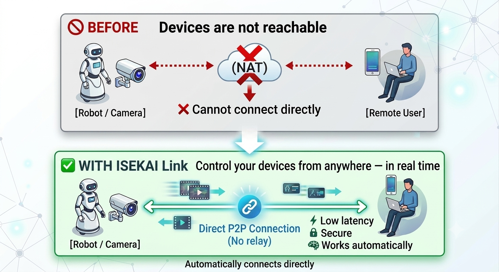

# ISEKAI Link

**Remote control, without the network headaches.**

**Control your devices from anywhere — in real time.**

ISEKAI Link connects your devices automatically 
and switches to direct P2P for low-latency control.

---

## 🚀 Why ISEKAI Link?

Building real-time remote control over the internet is hard:

- Devices are hidden behind NAT and firewalls  
- VPNs are complex and add latency  
- WebRTC requires signaling servers and tuning  
- Cloud routing introduces delays  

You end up fighting the network instead of building your product — and your users feel the latency.

---

## ✨ What ISEKAI Link does
ISEKAI Link handles networking for you:

- Connect automatically
- Switch to direct P2P when possible
- Fall back when needed

**No setup required.**

---

## ⚡ Key Features

- ✅ Low latency (direct P2P)
- ✅ Reliable (automatic fallback)
- ✅ Secure (end-to-end encryption)
- ✅ Zero setup (no networking required)

---

## 🧩 What you can build

### 🤖 Remote robot control
Operate robots from anywhere with real-time responsiveness.

---

### 📷 Camera access
Stream video from devices instantly with low latency.

---

### 🏭 Industrial IoT
Monitor and control equipment across networks.

---

### 🧪 Remote developer access
Access local devices or services securely from anywhere.

---

## 🔧 Under the hood
ISEKAI Link combines modern networking technologies:

- Direct peer-to-peer connections
- Automatic NAT traversal (hole punching)
- QUIC-based encrypted transport
- Built-in WebRTC signaling

## ⚙️ Advanced networking (optional)
For advanced use cases:

- Securely access local UDP services from anywhere
- Build custom real-time protocols
- Use ISEKAI Link beyond WebRTC limitations

ISEKAI Link adapts to your needs.

## 🔥 More than connectivity
ISEKAI Link is not just a network tool.

- Not just connectivity (like VPNs)
- Not just media transport (like WebRTC alone)
- Not just cloud IoT

It delivers a complete real-time control experience.

## 🚀 Get Started
Stop dealing with networking.
Start building real-time applications.

👉 Interested? Reach out or watch this repo for updates.
