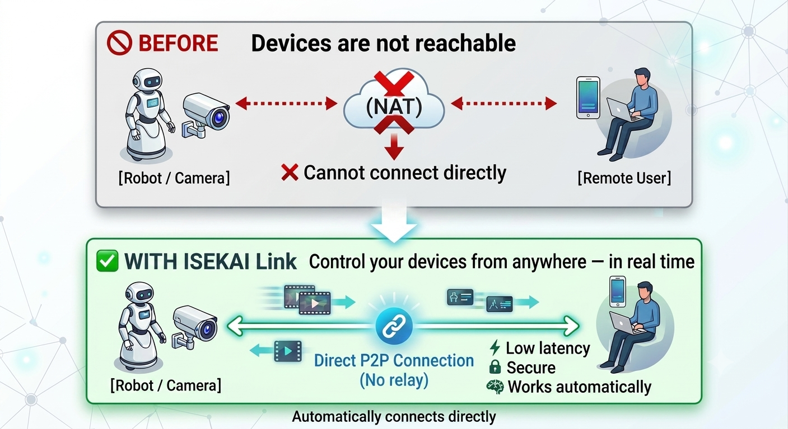
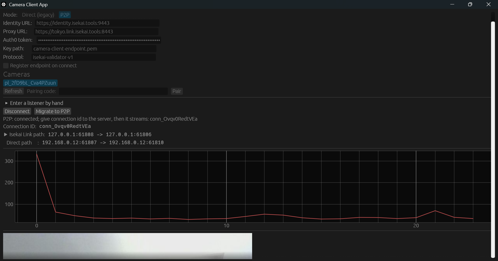
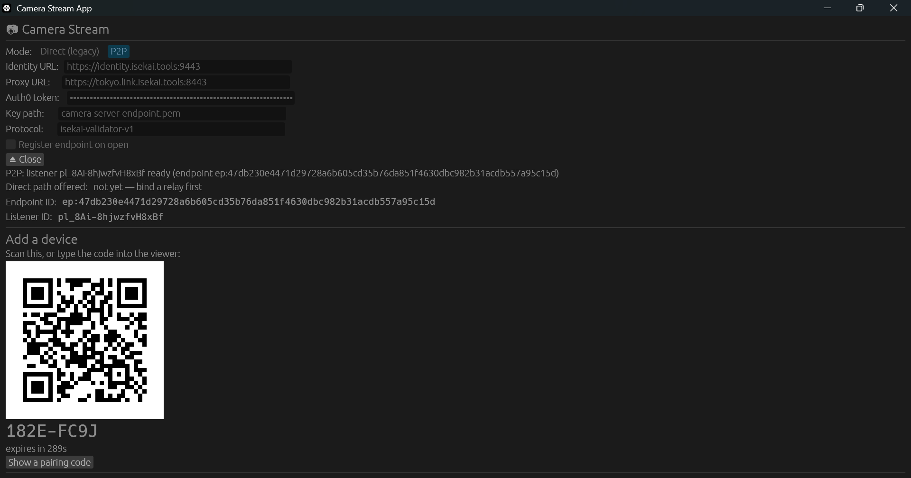

# ISEKAI Link

**Remote control, without the network headaches.**



**Control your devices from anywhere — in real time.**

ISEKAI Link connects your devices automatically<br>
and switches to direct P2P for low-latency control.

**Two apps you can run today.** *ISEKAI camera* streams video from one device to
another. *ISEKAI portal* maps a local port onto a TCP or UDP service behind
someone else's NAT. Both are built for Linux, macOS and Windows in
[Releases](https://github.com/seera-networks/ISEKAI-link/releases/latest), and
the archives carry the libraries they need.

---

## 🚀 Why ISEKAI Link?

Building real-time remote control over the internet is hard:

- Devices are hidden behind NAT and firewalls
- VPNs are complex and add latency
- WebRTC requires signaling servers and tuning
- Cloud routing introduces delays

You end up fighting the network instead of building your product — and your users feel the latency.

---

## ✨ What ISEKAI Link does

ISEKAI Link handles the networking for you:

- ✅ **Connects automatically** — no port to open, no firewall rule, no address to exchange
- ✅ **Goes direct when it can** — a relayed session moves onto a peer-to-peer path
- ✅ **Falls back when it must** — the relay stays available, and the session survives the switch
- ✅ **Encrypted end to end** — QUIC, with every device holding its own key

**No setup required.**

---

## 📉 Watch it go direct

A session starts on the relay and moves to a direct path as soon as one
validates — **mid-stream, without reconnecting**.



The client names both paths it is holding, and the graph is the round-trip time
across the switch. **One measurement on one pair of devices**, not a benchmark:
here the relayed leg runs out to the Tokyo proxy and back while the direct path
is a local one, which is the gap those first samples show closing.

---

## 🎬 Try it

### 📷 ISEKAI camera

Two desktop apps: one publishes a camera, the other watches it. There is an iOS
viewer and an Android client as well.

Download the archive for your platform from
[Releases](https://github.com/seera-networks/ISEKAI-link/releases/latest),
unpack it, and run the two halves on the two machines:

```sh
unzip camera-apps-ubuntu-latest.zip
cd camera-apps-ubuntu-latest
./camera-server        # the machine with the camera
./camera-client        # the machine that watches
```

Sign in, then the server shows a pairing code as text and as a QR code. Scan it
or type it into the viewer once, and the two stay paired — **including after the
camera app restarts.**



The mobile clients live in [`ios/`](ios/README.md) and [`android/`](android/).

### 🔌 ISEKAI portal

Reach a TCP or UDP service that has no public address, from a machine that also
has none. **[Read the guide →](docs/portal.md)**

On the machine with the services, say what may be reached and show a code:

```sh
portal-server --login
portal-server --example-config > portal-server.toml   # name the services
portal-server --register --pair                       # prints a pairing code
```

```toml
[service.db]
protocol = "tcp"
target   = "10.0.0.5:5432"
```

On the machine that wants them:

```sh
portal-client --login
portal-client --register --pair K7QM-3XPD    # once, ever
portal-client --map 5432:db                  # now: psql -h 127.0.0.1 -p 5432
```

**A peer asks for a service by name.** What `db` means is the server's business
and never crosses the wire, so a caller cannot reach anything the catalogue does
not offer — which is what keeps this from being an open proxy onto whatever
network the server sits on.

Pairing leaves a grant that outlives the session, so `--map` works tomorrow and
after the server has been restarted. Guests get a one-shot capability with a TTL
instead.

---

## 🧩 What you can build

**Shipping in this repository:**

### 📷 Camera access
Stream video from devices instantly, with the session moving to a direct path on
its own.

### 🧪 Remote developer access
Reach a database, an SSH port or a DNS resolver on a network you are not on —
no firewall rule and no reachable address on either side.

**What the same transport is for:**

### 🤖 Remote robot control
Operate robots from anywhere with real-time responsiveness.

### 🏭 Industrial IoT
Monitor and control equipment across networks.

---

## 🔧 Under the hood

ISEKAI Link combines modern networking technologies:

- Direct peer-to-peer connections
- Automatic NAT traversal (hole punching)
- Live migration from a relayed path to a direct one, without dropping the connection
- QUIC-based encrypted transport
- Built-in WebRTC signaling

Path selection reads per-path statistics rather than the connection's, which
describes only the first path — so the choice is made on what each path is
actually doing.

## ⚙️ Advanced networking (optional)

For advanced use cases:

- Securely access local UDP services from anywhere
- Build custom real-time protocols
- Use ISEKAI Link beyond WebRTC limitations

ISEKAI Link adapts to your needs.

## 🔥 More than connectivity

ISEKAI Link is not just a network tool.

- Not just connectivity (like VPNs)
- Not just media transport (like WebRTC alone)
- Not just cloud IoT

It delivers a complete real-time control experience.

---

## 🚀 Get started

Stop dealing with networking. Start building real-time applications.

- **Run something** — [Releases](https://github.com/seera-networks/ISEKAI-link/releases/latest)
- **Forward a port** — [the ISEKAI portal guide](docs/portal.md)
- **Build from source** — [`docs/Build.md`](docs/Build.md)
- **Questions, or want this behind your own product?** Open an issue, or reach out.
