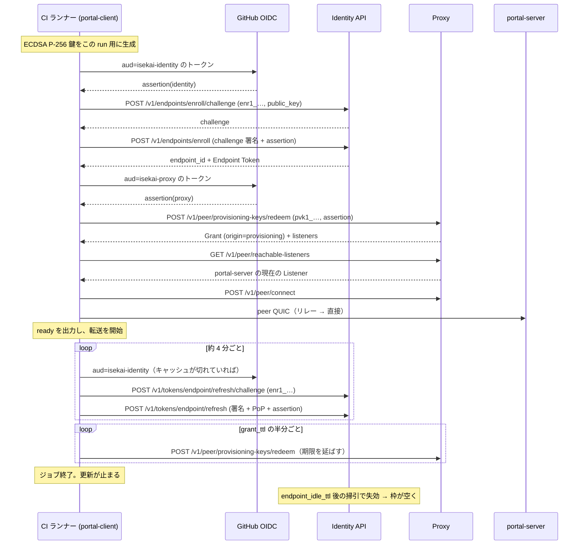

# ISEKAI portal — CI からの無人接続（Enrollment Key / Provisioning Key）

実装計画。対象は `isekai-p2p-core` / `isekai-p2p` / `portal-core` / `portal-client` /
`portal-server` / `.github/workflows` と `docs/portal.md`。

根拠は **P2P Connect 仕様 §8.8（Enrollment Key API）** と
**ISEKAI Link Server 仕様 §8.13（Provisioning Key API）**。以下、前者を「Identity 仕様」、
後者を「Proxy 仕様」と書く。

> **改訂 1（上流の回答を反映）。** 初版が §7 に挙げた未解決 2 件は
> [ISEKAI-identity#32](https://github.com/seera-networks/ISEKAI-identity/pull/32) で解決した。
> **ジョブは自分で枠を返せる**ようになり（§4.6）、**`refresh/challenge` に assertion は要らない**
> ことが仕様に明記された（§2.1）。枠の見積もりと推奨値（§4.6 / §6.3）、`portal-client` の
> 終了経路（§2.5）、フェーズ 1 と 5 の受け入れ条件がそれぞれ変わっている。

---

## 0. 何を決めたか

CI のジョブが、人の操作なしに **自分の Endpoint を作り、portal-server に到達する認可を得て、
ローカルポートを転送する**ところまでを 1 コマンドで走らせられるようにする。

要るのは **2 本の鍵**で、発行するサーバも、失効させるサーバも違う。

| # | 塞ぐ穴 | 鍵 | 発行元 | 前置 |
| --- | --- | --- | --- | --- |
| **P1** | CI ランナーには Endpoint が無い。§4.3 の登録は Auth0 認証状態を要求する | **Enrollment Key** | Identity API | `enr1_` |
| **P2** | Endpoint はあるが、毎回 owner が Ticket を出せない | **Provisioning Key** | Proxy | `pvk1_` |

**片方だけでは用を成さない。** P1 だけなら Endpoint は生えるが誰にも繋げない。P2 だけなら
対象は「一度人手で登録した長寿命ランナー」に限られる。CI のシークレットには **2 本入れる**
（Identity 仕様 §8.8.1 / §8.8.12）。

```text
Enrollment Key (Identity)          Provisioning Key (Proxy)
  ↓ 無人で Endpoint を作る            ↓ 無人で Grant を作る
ep:CI が生える                     ep:CI が portal-server の Listener に到達できる
```

決めたことは 5 つ。

1. **既存の Auth0 経路は残す。** 無人経路は代替であって置き換えではない。`P2pConfig` の
   認証部分を列挙型（§2.3）にして、どちらを使っているかが型で読めるようにする。
2. **assertion は「1 本もらう」のではなく「毎回鋳造する」。** これは利便ではなく、
   Identity 仕様 §8.8.7 が更新のたびに `binding` の検証を要求していることの帰結である（§4.2）。
3. **秘密は argv に載せない。** 鍵は環境変数かファイルから読む（§4.1）。
4. **CI では鍵ペアを毎回生成する。** 1 鍵 = 1 Endpoint なので、使い回すと 2 回目のジョブが
   `409 endpoint-already-registered` で落ちる（§4.4）。
5. **ジョブは出るときに枠を返す。** 掃引は保険であって片付けの主経路ではない（§4.6）。
   これは改訂 1 で足した。上流が自己失効を用意したので、枠の見積もりが「累積」から
   「並列度」に変わっている。

---

## 1. いま何ができていて、何ができていないか

### 1.1 いま CI が抱えている問題

`.github/workflows/ios-ffi.yml` は Identity/Proxy を使う唯一の統合テストを持っており、
そこにこう書いてある。

> An Auth0 access token for the live Identity/Proxy. […] Access tokens expire, so this
> needs periodic refreshing — **minting one from machine-to-machine credentials would be
> the durable fix.**

本計画はその「durable fix」である。ただし Auth0 の M2M ではなく、仕様が定めた
Enrollment Key を使う。Auth0 の M2M クレデンシャルは Identity API の系統 A に
そのまま流し込めるが、それは「Auth0 を迂回する口を自前で開ける」ことに等しく、枠も
`binding` も派生 Endpoint の掃引も付いてこない。

### 1.2 実装済み

| 仕様 | 実装 |
| --- | --- |
| §8.1.1 / §8.1.2 登録 | `isekai_p2p_core::identity::{register_challenge, register}` |
| §8.2.1 Endpoint Token 発行 | `identity::issue_token`（PoP つき） |
| §8.9 ペアリング | `proxy::pair_with_code` / `pair_with_listener` |
| §8.12 Ticket | `proxy::{create_ticket, list_tickets, revoke_ticket, redeem_ticket}` |
| §8.10 到達可能な Listener | `proxy::list_reachable_listeners` |
| 接続 | `portal_core::session::{Reach, connect}` |
| トークンの更新ループ | `isekai_p2p::config::spawn_token_renewal` |

### 1.3 未実装 — ここが工数の本体

| 仕様 | 内容 | 備考 |
| --- | --- | --- |
| §8.2.2 / §8.2.3 | 更新用 Challenge と **更新** | **これが無いと無人経路が 15 分で死ぬ** |
| §8.8.2 / §8.8.9 | Enrollment Key の発行・一覧・登録記録・失効 | 系統 A（Auth0 AT、PoP 無し） |
| §8.8.4 / §8.8.5 | 無人 Challenge と無人登録 | `Authorization` を持たない第 3 の経路 |
| §8.8.7 | Enrollment Key による更新 | §8.2.2 / §8.2.3 の変種 |
| §8.7 | 失効。**Enrollment Key + PoP でも呼べる** | 改訂 1。有人経路とは必須項が違う |
| §8.13.3 / §8.13.7 | Provisioning Key の発行・一覧・引き換え記録・失効 | 系統 B |
| §8.13.5 | 引き換え | 系統 B、`assertion` つき |

**ここで一番効く事実**: 現在の更新ループは §8.2.1（発行）を 4 分おきに呼び直しているが、
**§8.2.1 は Auth0 AT を要求する**。無人 Endpoint はそこへ行けない。したがって
**§8.2.2 / §8.2.3 の実装は「あると良い」ではなく、この計画の前提条件**である。
Identity 仕様 §8.8.7 が「更新できなければ、無人登録は最長 15 分しか持たない」と書いている
のはこのことである。

### 1.4 触らないと決めたもの

- **Initiator 側は ACME 証明書を注文しない。** `portal_core::session` で
  `endpoint_cert::issue` を呼ぶのは `serve`（portal-server）だけで、`connect` は
  `endpoint_cert::dev_cert` の側を通る。したがって CI が毎回新しい Endpoint を作っても、
  `ios-ffi.yml` が警戒している Let's Encrypt の週 50 通の枠は消費しない。
  **portal-server を CI で立てる場合は話が別で、そちらは鍵をピン留めしたまま残す。**
- `Reach` に列挙子は足さない（§2.5）。

---

## 2. 責務の割り当て

### 2.1 `isekai-p2p-core::identity`

**責務: Identity API の経路を 3 系統に増やす。**

いまこのモジュールが持っている暗黙の前提は「すべての要求は `Authorization: Bearer
<auth0_at>` を持つ」であり、`post_bytes` はそれを無条件に組み立てている。無人経路は
**`Authorization` ヘッダを持たず、資格情報をボディに置く**（Identity 仕様 §8.8.4）ので、
ここを分ける。

1. **認証の型を導入する。**

   ```rust
   /// Identity API に対する「私は誰か」の言い方。
   pub enum IdentityAuth<'a> {
       /// 系統 A。`Authorization: Bearer`。
       Auth0(&'a str),
       /// 第 3 の資格（§8.8.4）。`Authorization` を持たず、ボディに載る。
       /// `assertion` は `binding.type` が `oidc` のときのみ。
       Enrollment { key: &'a str, assertion: Option<&'a str> },
   }
   ```

   `post_bytes` は `IdentityAuth` を取り、`Auth0` のときだけヘッダを付ける。
   ボディへの差し込みは呼び出し側でやる（署名対象のバイト列が確定してから PoP を作る
   必要があるため、いまの `issue_token` と同じ順序を守る）。

2. **§8.2.2 / §8.2.3 を実装する。**

   ```rust
   pub async fn refresh_challenge(&self, auth: IdentityAuth<'_>, endpoint_id: &str)
       -> Result<Challenge, IdentityError>;
   pub async fn refresh_token(&self, auth: IdentityAuth<'_>, key: &EndpointKey,
                              challenge: &Challenge, ttl: Option<i64>)
       -> Result<EndpointToken, IdentityError>;
   ```

   - 署名対象は `challenge ‖ endpoint_id ‖ timestamp`。**既存の `sign_challenge` が
     そのまま使える**（§8.8.5 も同じ対象である旨が仕様に明記されている）。
   - PoP は `Auth0` でも `Enrollment` でも必須。置き換わるのは Auth0 認証状態の側だけで、
     「Endpoint 秘密鍵の所持」は変わらない（§8.2.3 の但し書き、§8.8.7）。
   - `requested_permissions` / `requested_protocols` は **渡さない**。更新は
     「現在の天井 ∩ 直前のトークン」に単調に縮むのが仕様の既定で、明示するのは
     さらに絞りたいときだけである。
   - **`refresh_challenge` に assertion は渡さない。** ボディは
     `{ endpoint_id, enrollment_key }` だけである。`binding` を見るのは §8.2.3 のみで、
     両方で要求するとその間に OIDC トークンが切れる余地を無駄に作る（§8.8.4 と同じ判断）。
     **したがって更新 1 回あたりの鋳造は 1 回で足りる。**

3. **§8.8.4 / §8.8.5 を実装する。**

   ```rust
   pub async fn enroll_challenge(&self, enrollment_key: &str, key: &EndpointKey)
       -> Result<Challenge, IdentityError>;
   pub async fn enroll(&self, auth: IdentityAuth<'_>, key: &EndpointKey,
                       challenge: &Challenge, device_name: Option<&str>, ttl: Option<i64>)
       -> Result<Enrolled, IdentityError>;
   ```

   `Enrolled` は登録と最初のトークンを 1 往復で運ぶ（§8.8.5）。

   ```rust
   pub struct Enrolled {
       pub endpoint_id: String,
       pub endpoint_token: String,
       #[serde(default)] pub expires_in: Option<i64>,
       #[serde(default)] pub device_id: Option<String>,
       #[serde(default)] pub tenant_id: Option<String>,
       #[serde(default)] pub enrollment_key_id: Option<String>,
       #[serde(default)] pub ephemeral: Option<bool>,
       #[serde(default)] pub expires_at: Option<String>,
       #[serde(default)] pub permissions: Vec<String>,
       #[serde(default)] pub protocols: Vec<String>,
   }
   ```

   **必須は 2 つだけで、残りは省略可にする。** `Ticket` と `Grant` が同じ形をしているのと
   同じ理由であり、ここではその理由が一段強い。パースに失敗した登録応答は、
   **枠を 1 つ消費し、Challenge を消費し、しかもその鍵ペアは二度と登録できない**
   （1 鍵 = 1 Endpoint、以後 `409`）。`device_id` が欠けていることに払う代償ではない。

4. **§8.8.2 / §8.8.9 を実装する**（Enrollment Key の発行・一覧・登録記録・失効）。
   系統 A のみ。PoP は付けない（呼び出し元は人であって Endpoint ではない）。

5. **§8.7 の失効を、Enrollment Key でも呼べるようにする。**

   ```rust
   pub async fn revoke_endpoint(&self, auth: IdentityAuth<'_>, key: &EndpointKey,
                                endpoint_id: &str, reason: Option<&str>, note: Option<&str>)
       -> Result<Revoked, IdentityError>;
   ```

   `IdentityAuth::Enrollment` のとき、**更新（§8.8.7）とまったく同じ組**（鍵 + PoP）だが
   **2 点だけ違う**。

   - **`assertion` は渡さない。** `binding` が答えているのは「この鍵で何かを*得て*よいのは
     誰か」であり、失効は何も得ない。**止める側の要求を進む側より重くしない** — ジョブが
     異常終了して OIDC トークンを鋳造できない場面でこそ枠を返してほしい。
     したがって `Enrollment { assertion: None }` で呼ぶのが正しく、
     手元に assertion があっても付けない。
   - **`reason` は渡せない。** Identity が `enrollment_released` を付ける。有人経路の
     `reason` は引き続き必須なので、`Auth0` と `Enrollment` で必須項が入れ替わる —
     型で分けずに `Option` 1 つで通すと、有人経路の `reason` 忘れが `400` になって初めて
     分かる。**呼び分けは引数ではなく `IdentityAuth` の側で決まる**ことをテストで固定する。

   できるのは**自分を止めることだけ**である（PoP がその Endpoint の秘密鍵を要求する）。
   漏れた鍵だけでは、同じ鍵で生やした別の Endpoint も、有人登録の Endpoint も止められない。

6. **エラーの一様性を潰さない。** `403 enrollment-key-invalid` は未知・期限切れ・失効・
   owner 失効を区別しない。クライアント側で「鍵が期限切れでは？」と推測して表示しない。
   ただし **`429 enrollment-slots-exhausted` は区別して見せる** — 仕様がそこだけ
   例外にしているのは、CI のログから「鍵が悪いのか混んでいるのか」を切り分けるためである。

7. **`Retry-After` を返り値に載せる。** `IdentityError::Api` に `retry_after: Option<Duration>`
   を足す。§8.8.6 は `Retry-After` に掃引の遅れを足した値を載せると定めており、それを
   無視して自前の間隔で再試行するクライアントは必ず 2 度目の `429` を受ける。

### 2.2 `isekai-p2p-core::proxy`

**責務: §8.13 を、Ticket と同じ形で足す。**

1. 型を足す: `ProvisioningKey`（発行応答、`key` のみ必須）、`ProvisioningKeyRecord`（一覧）、
   `Redemption`（引き換え記録）、`RedeemedProvisioning { grant, listeners }`。
   最後は `RedeemedTicket` と同一の形なので、**内部表現を共有する**。
2. メソッドを足す。

   ```rust
   pub async fn create_provisioning_key(&self, protocol: &str, ttl: Option<u64>,
       grant_ttl: Option<u64>, max_live_grants: Option<u32>,
       binding: Option<&Binding>, label: Option<&str>) -> Result<ProvisioningKey, ProxyError>;
   pub async fn list_provisioning_keys(&self) -> Result<Vec<ProvisioningKeyRecord>, ProxyError>;
   pub async fn provisioning_redemptions(&self, key_id: &str) -> Result<Vec<Redemption>, ProxyError>;
   pub async fn revoke_provisioning_key(&self, key_id: &str) -> Result<(), ProxyError>;
   pub async fn redeem_provisioning_key(&self, key: &str, assertion: Option<&str>,
       label: Option<&str>) -> Result<RedeemedProvisioning, ProxyError>;
   ```

3. `Grant` に `provisioning_key_id: Option<String>` を足す（`origin` が `provisioning` の
   ときだけ載る）。`origin` の doc コメントに `provisioning` を追記する。
4. **`redact_tickets` を `redact_secrets` に広げる。** いまは `tkt1_` / `iskt1_` だけを
   伏せているが、`enr1_` と `pvk1_` は**同じ用途で同じ危険**を持つ。前置が固定なのは
   まさにこの検索のためだと両仕様が書いている。呼び出しは `portal-client` に 1 か所。
5. **`Retry-After` を `ProxyError` に載せる**（§8.13.5 の枠と §8.13.6 の `503`）。

### 2.3 `isekai-p2p::auth` / `isekai-p2p::config`

**責務: 資格情報の継ぎ目を 1 か所にする。ここが本計画で唯一の破壊的変更である。**

1. **`P2pConfig` の認証 2 フィールドを列挙型に置き換える。**

   ```rust
   pub enum Credential {
       /// 系統 A。いまある経路。
       Auth0 { token: String, source: Option<Arc<dyn Auth0TokenSource>> },
       /// §8.8。無人の経路。
       Enrollment(Enrollment),
   }

   pub struct Enrollment {
       /// `enr1_…`。
       pub key: String,
       /// `binding.type` が `oidc` のとき必須。audience ごとに鋳造する。
       pub assertion: Option<Arc<dyn AssertionSource>>,
       /// **登録は 1 プロセスに 1 回だけ。** 下記。
       enrolled: Arc<OnceLock<String>>,
   }
   ```

   `P2pConfig` から `auth0_token` と `auth0` が消え、`credential: Credential` が入る。
   構築箇所は 14 か所（camera 系、FFI、agent、portal 両側、テストと例）あるが、
   `Credential::auth0(token, source)` のコンストラクタを置けば各所 1 行の機械的な差分になる。

   > **`enrollment: Option<…>` を足すだけにしない。** そのほうが差分は小さいが、
   > 「Auth0 の 2 フィールドが黙って無視される設定」が表現できてしまう。それは数手先の
   > `401` として現れ、原因の側を何も指さない。この repo が `--map` の protocol を
   > 推測せずに言わせているのと同じ判断である。

2. **`enrolled` は共有状態でなければならない。** `P2pConfig` は `Clone` で、更新ループは
   クローンを持って走る。ここが値だと、クローンした側が 2 度目の登録を試み、
   **同じ鍵ペアなので必ず `409` で落ちる**。`Arc<OnceLock<String>>` にして、
   「まだ登録していない → §8.8.4 / §8.8.5」「登録済み → §8.2.2 / §8.2.3」を分岐する。
   `auth0: Option<Arc<dyn Auth0TokenSource>>` が既に `Arc` を持っているのと同じ理由である。

3. **`AssertionSource` を足す。** `Auth0TokenSource` の隣、同じ形。

   ```rust
   pub trait AssertionSource: Send + Sync {
       /// `audience` 向けのワークロード ID トークンを、いま有効な形で返す。
       fn assertion(&self, audience: &str)
           -> Pin<Box<dyn Future<Output = anyhow::Result<String>> + Send + '_>>;
   }
   ```

   **`audience` を引数に取るのが要点である。** Identity の既定は `isekai-identity`、
   Proxy の既定は `isekai-proxy` で、**両仕様は意図的に別の値にしている**。1 本のトークンを
   使い回す設計にすると、片方に出したトークンが他方で通ってしまう構造を自分で作ることに
   なる。

   実装は 2 つ。

   | 実装 | 取り方 |
   | --- | --- |
   | `GithubActionsOidc` | `ACTIONS_ID_TOKEN_REQUEST_URL` に `&audience=` を付けて GET し、`ACTIONS_ID_TOKEN_REQUEST_TOKEN` を bearer にする。ワークフローに `permissions: id-token: write` が要る |
   | `TokenFiles` | audience → パスの対応表。呼ばれるたびに読み直す（Kubernetes の projected SA トークンはその場で差し替わる） |

   どちらも **audience ごとにキャッシュし、`exp` の手前 60 秒で捨てる**。更新は 4 分おきに
   走るので、毎回鋳造すると発行者への要求が増えるだけで、`exp` まで有効なトークンを
   捨てる理由が無い。

4. **`issue_endpoint_token` を分岐させる。**

   ```text
   Credential::Auth0       → いまと同じ（register?→ §8.2.1）
   Credential::Enrollment  → 未登録: §8.8.4 → §8.8.5（登録と最初のトークンが 1 往復）
                             登録済: §8.2.2 → §8.2.3（毎回 assertion を鋳造し直す）
   ```

   `cfg.register` は **`Enrollment` では意味を持たない**。無人経路では登録は
   選択肢ではなく最初の一歩である。`register: true` と併せて渡されたら黙って無視せず、
   構築時に弾く。

5. **`spawn_token_renewal` は変えない。** いまも `issue_endpoint_token(&cfg)` を呼ぶだけで、
   分岐は 4 の中にある。`renew_delay` / `retry_delay` もそのまま使える。
   ただし **更新の成功が `ephemeral` の「最終利用」を押し上げる**（§8.8.8）ことは
   コメントに書く — この更新ループが止まった瞬間から `endpoint_idle_ttl` の時計が
   動きはじめる、というのが CI の枠の返り方そのものである。

### 2.4 `portal-core`

**責務: Grant を保つ。**

`session::connect` と `Reach` は変えない（§2.5）。足すのは 1 つ。

```rust
/// 引き換えた Grant を、鍵が生きているあいだ更新しつづける。
pub fn keep_the_grant(directory: Arc<PeerDirectory>, key: String,
                      assertion: Option<Arc<dyn AssertionSource>>,
                      expires_at: Option<String>, shutdown: CancellationToken) -> GrantKeeper;
```

- **なぜ要るか。** `grant_ttl` の既定は 1,800 秒で、上限は 3,600 秒である（Ticket の
  86,400 より意図的に狭い）。**その狭さは再引き換えで延びることを前提にしている**
  （Proxy 仕様 §8.13.5）。1 時間を超える CI ジョブは、これが無いと途中で認可を失う。
- 期限の半分、または `expires_at − 5 分` の早いほうで再引き換えする。応答は `200` で、
  期限は `max(既存, now + grant_ttl)` に延びる。
- **再引き換えにも assertion が要る**（`binding.type` が `oidc` なら毎回）。§4.2 と同じ話が
  Proxy 側にも立つ。
- 失敗はセッションを落とさない。トークン更新と同じで、いまの Grant は期限まで効いている。
  `retry_delay` と同じ後退で再試行する。
- **枠は増えない。** 同じ Endpoint の再引き換えは同じ 1 枠であり、しかも更新は
  枠が埋まっていても通る（§8.13.5）。

### 2.5 `portal-client`

**責務: CI の 1 コマンド。**

新しいフラグ。

| フラグ | 意味 |
| --- | --- |
| `--enroll` | 環境の Enrollment Key で無人登録する。**明示のスイッチ**であり、環境変数の有無で暗黙に切り替えない |
| `--enrollment-key-file <path>` | 既定は環境変数 `ISEKAI_ENROLLMENT_KEY` |
| `--provisioning-key-file <path>` | 既定は環境変数 `ISEKAI_PROVISIONING_KEY` |
| `--oidc <github\|files\|none>` | assertion の出どころ。既定 `none` |
| `--oidc-token-file <aud>=<path>` | `--oidc files` のとき。繰り返し可 |
| `--issue-enrollment-key` ほか | 鍵の発行・一覧・登録記録・失効（§2.6 と対になる、owner 側の操作） |

**秘密を取るフラグは置かない。** `--enrollment-key <値>` は作らない（§4.1）。

制御フローは既存の `--pair` / `--redeem` の並びに素直に入る。

```text
--pair <code>        → pair_with_code        ┐
--redeem <ticket>    → redeem_ticket         ├ どれも「入れてもらう」で、
--provisioning-key…  → redeem_provisioning   ┘ 返るのは owner の Endpoint ID
                                               → 続けて --map があればそのまま接続
```

すなわち `Reach` に列挙子は要らない。引き換えは接続の前段で済み、そのあとは
既存の `Reach::Grant { peer }` がそのまま働く — **これは偶然ではなく、Grant が
Listener を鍵に含まないという §8.8 の設計の帰結**である。

加えて 2 つ。

- **`--enroll` と保存済みサインインの併用を弾く。** どちらの資格で立っているのかが
  読めない状態を作らない。
- **すべての転送を bind し終えたら `ready` を 1 行 stdout に出す。** CI の待ちループが
  掴む点が要る。`camera-core` の `synthetic_server` が同じことをしていて、
  `ios-ffi.yml` はそれを `grep -q '^ready$'` で待っている。
- **出るときに枠を返す**（§2.1 の 5）。`connected.close()` の直後、
  `portal_core::shutdown::leave` の手前で失効を 1 回打つ。
  - **失敗しても終了コードを変えない。** 掃引という保険が後ろにあり、転送は成功していた
    のだから、片付けの失敗を仕事の失敗として報告しない。`warn!` で言うだけにする。
  - **締切を付ける**（3 秒程度）。ここで待つのは終了を遅らせるだけの往復であり、
    Identity が黙っているときに CI のジョブを引き延ばす理由が無い。
  - **`--enroll` のときだけ。** 有人経路の Endpoint は端末の身元であって、
    プロセスの終了で消してよいものではない。

**そして SIGTERM を捕まえる。** いまの `tokio::select!` は `tokio::signal::ctrl_c()`
= SIGINT だけを見ており、**ワークスペースのどこも SIGTERM を扱っていない**。CI が
`kill <pid>` で止めると既定の処理で即座に死に、**上の失効は一度も走らない** —
枠を返す経路を足しても、CI がそれを呼ばない形になる。Unix では
`signal::unix::SignalKind::terminate()` を同じ腕に足す。

### 2.6 `portal-server`

**責務: Provisioning Key を出す側。**

`--ticket` / `--tickets` / `--revoke-ticket` と完全に並行な 4 つを、同じ
`grant_admin` の上に足す。

| フラグ | 対応 |
| --- | --- |
| `--provisioning-key` | §8.13.3 発行。`--provisioning-ttl` / `--grant-ttl` / `--max-live-grants` / `--provisioning-label` / `--bind-oidc <issuer> <subject>` |
| `--provisioning-keys` | §8.13.7 一覧（`live_grants` と `redemption_count` つき） |
| `--provisioning-redemptions <id>` | §8.13.7 引き換え記録。**誰が入ったか**を後から辿る唯一の口 |
| `--revoke-provisioning-key <id>` | §8.13.7 失効。**派生 Grant も消える** |

失効の出力は `--revoke-ticket` と**逆のことを言わなければならない**。Ticket の失効は
「入った人は出ていかない」だが、Provisioning Key の失効は派生 Grant を消す
（Proxy 仕様 §8.13.7 が意図的に反転させている）。走行中のジョブが落ちる、と出力に書く。

**前提**: 発行には新しい permission `peer-provisioning:create` が要る（§8.13.2）。
`peer-connect:accept` では発行できない。運用者の Endpoint の天井にこれが無ければ
`403 insufficient-permission` で止まる — §5 のフェーズ 0 で確認する。

### 2.7 CI ワークフロー

`.github/workflows/` に、上記を使う形を 1 つ置く。まずは `portal.yml` の統合ジョブとして。

```yaml
permissions:
  id-token: write        # これが無いと ACTIONS_ID_TOKEN_REQUEST_* が生えない
  contents: read
env:
  ISEKAI_ENROLLMENT_KEY:   ${{ secrets.ISEKAI_ENROLLMENT_KEY }}
  ISEKAI_PROVISIONING_KEY: ${{ secrets.ISEKAI_PROVISIONING_KEY }}
steps:
  - name: Forward the server's ports into this runner
    if: env.ISEKAI_ENROLLMENT_KEY != '' && env.ISEKAI_PROVISIONING_KEY != ''
    run: |
      set -euo pipefail
      LOG="$RUNNER_TEMP/portal-client.log"
      ./target/debug/portal-client \
        --enroll --oidc github \
        --key "$RUNNER_TEMP/ci-endpoint.pem" \
        --device-name "gha-${GITHUB_RUN_ID}" \
        --label "gha-${GITHUB_RUN_ID}-${GITHUB_RUN_ATTEMPT}" \
        --map 15432:db > "$LOG" 2>&1 < /dev/null &
      echo $! > "$RUNNER_TEMP/portal-client.pid"
      for _ in $(seq 1 120); do grep -q '^ready$' "$LOG" && exit 0; sleep 1; done
      cat "$LOG"; exit 1
```

- **`if:` で 2 本とも要求する。** `ios-ffi.yml` が 2 つのシークレットに対して同じことを
  している。半分だけ設定されたリポジトリが枠を静かに食う状態を作らない。
- `--key` は `$RUNNER_TEMP` に置く。**毎回新しい鍵ペアであることが正しい**（§4.4）。
- **止め方は `if: always()` の後始末ステップで、シグナルを送って待つ。**

  ```yaml
  - name: Stop the forward and give the slot back
    if: always()
    run: |
      PID=$(cat "$RUNNER_TEMP/portal-client.pid" 2>/dev/null) || exit 0
      kill -TERM "$PID" 2>/dev/null || exit 0
      for _ in $(seq 1 10); do kill -0 "$PID" 2>/dev/null || exit 0; sleep 1; done
      kill -KILL "$PID" 2>/dev/null || true
  ```

  **`always()` でなければ意味が無い。** 枠を返してほしいのは、テストが落ちて
  ジョブが途中で終わるときこそである。`kill -9` に直行すると失効は走らず、
  掃引まで枠が埋まったままになる（§4.6）。

---

## 3. 全体のフロー



---

## 4. 決めたことと、その理由

### 4.1 秘密は argv に置かない

`--enrollment-key <値>` というフラグは作らない。理由は 3 つあり、どれも単独で十分である。

- Linux では `/proc/<pid>/cmdline` が同一 UID の任意のプロセスから読める。CI ランナーは
  他人のコードを走らせる場所である。
- `set -x` の付いたシェル、失敗したステップのログ、`ps` を撮るデバッグ用ステップ —
  どれも argv をそのまま吐く。
- 既存の `--auth0-token` は同じ問題を持つが、**あれは人が対話で使うもの**で、しかも
  `--login` という代替が既にある。無人経路には対話が無いので、代替を先に決めておく。

読み方は 2 つだけ: 環境変数（既定）と、ファイル（`--*-key-file`）。ファイルから読むときは
末尾の改行を落とす。

### 4.2 assertion は毎回鋳造する

**「ジョブの頭で 1 本取って渡す」では動かない。** Identity 仕様 §8.8.7 は
`binding` を**更新のたびに**検証すると定めており、しかもそれは緩められる制限ではなく、
`oidc` の鍵が「ジョブが終われば更新できなくなる」という**歯止めそのもの**である。
更新は 4 分おきに走り、GitHub の ID トークンは 5〜15 分で切れる。1 本渡しは
2〜3 回目の更新から `403 enrollment-binding-invalid` になる。

したがって `AssertionSource` は「値」ではなく「取り方」を持つ。§2.3 の 3 を参照。

同じ理由で、§8.8.3 が **`iat` に PoP と同じ ±60 秒を課してはならない**と書いていることを
クライアント側でも守る: 後退再試行（`429` / `503` の `Retry-After`）のあと、手元の
assertion は 60 秒より古い。それを「古いから捨てる」と判断してはならない。判断するのは
`exp` である。

### 4.3 audience は 2 つある

Identity は `isekai-identity`、Proxy は `isekai-proxy`。**揃えるのは運用者の設定であって
クライアントの都合ではない。** `AssertionSource::assertion(audience)` が audience を
取るのはこのためで、`--oidc files` のときも audience → パスの対応で持つ。
1 本を両方に使い回す近道を API の形で塞ぐ。

### 4.4 CI では鍵ペアを毎回作る

1 鍵 = 1 Endpoint（§8.8.6）。同じ鍵ペアで 2 度目を登録すると `409
endpoint-already-registered` で、しかも**枠は空かない**。したがって使い捨てランナーは
毎回新しい鍵ペアを作る — それは前提であって、回避すべき無駄ではない。

**これは `ios-ffi.yml` が `ENDPOINT_KEY_PEM` をピン留めしているのと矛盾しない。**
あちらは Listener 側（`synthetic_server`）で、Endpoint ごとに ACME 証明書が要る。
portal-client は Initiator で、証明書を注文しない（§1.4）。**portal-server を CI で
立てるときは、あちらと同じくピン留めする**。

### 4.5 Grant は保持ではなく更新する

§2.4。`grant_ttl` の上限が Ticket より狭いのは再引き換えが効く前提だから、というのが
Proxy 仕様の書きぶりであり、クライアントがそれをやらないと上限の狭さだけが残る。

### 4.6 枠はジョブが返す。掃引は保険である

**初版から変わった箇所である。** 初版は「§8.7 の失効は Auth0 AT を要求するので CI からは
呼べず、掃引を待つしかない」と書き、それを §7 の未解決 1 に挙げた。上流がこれを
解決した（ISEKAI-identity#32）ので、見積もりが変わる。

| | 初版（掃引だけ） | 改訂（自己失効あり） |
| --- | --- | --- |
| `max_live_endpoints` | 並列度 × (実行時間 + `idle_ttl`) / 実行間隔 | **並列度そのもの** |
| `endpoint_idle_ttl` | 枠が空くまでの時間そのもの | **呼べなかったときの保険** |

初版の見積もりが痛かったのは、既定（枠 4 / `idle_ttl` 3,600 / 掃引 300）で 5 分の
ジョブを並列 4 で回すと **4 枠が約 1 時間占有され**、詰まるのは「同時 5 本目」では
なく次に来たジョブだった、という点である。約 55 分にわたって
`429 enrollment-slots-exhausted` が返っていた。自己失効を呼べば、枠はジョブの終了と
同時に空く。

**それでも `endpoint_idle_ttl` は短く置く。** 失効が呼ばれないケースは残る —
ランナーの強制終了、`kill -9`、ネットワークが切れたまま終わるジョブ。生きている
ランナーは 4 分ごとにトークンを更新するので、1,800 で足りる。

**掃引を主経路にしない。** §2.5 の終了処理と §2.7 の後始末ステップは、どちらもこの
ためにある。返せるはずの枠を掃引に任せると、`idle_ttl` を短くするしかなくなり、
今度は更新が数回続けて失敗しただけのランナーが落ちる。

### 4.7 一様な `403` を、そのまま見せる

`403 enrollment-key-invalid` と `403 provisioning-key-invalid` は、未知・期限切れ・失効を
区別しない。**クライアントが推測して補ってはならない** — それをやると、拾った鍵の状態を
問い合わせる口をクライアント側に再実装したことになる。

区別して見せてよいのは仕様が区別しているものだけ:

| 応答 | 見せ方 |
| --- | --- |
| `403 …-key-invalid` | 「この鍵では通らない」。理由は言わない。**両方のサーバの鍵を確認するよう促す**（どちらの鍵かはメッセージで区別できる） |
| `403 enrollment-binding-invalid` / `provisioning-binding-invalid` | **鍵は有効。設定が違う。** ブランチ・リポジトリ・audience を疑う旨を出す |
| `429 …-slots-exhausted` | 混んでいる。`Retry-After` に従う |
| `503 …-unavailable` | 発行者の JWKS が引けない。後退して再試行 |

`binding-invalid` を `key-invalid` に畳み込まないのは仕様の明示的な判断であり、
**運用者が「鍵が漏れたのか設定を間違えたのか」を切り分けられるかどうか**がそこで決まる。

### 4.8 設定の不整合は、踏む前に言う

Identity 仕様 §8.8.10 が「運用で最も踏まれる」と書いているもの。Identity は Proxy 側の
鍵の設定を知らないので検証できない。できるのは 2 つ。

- 発行応答の `warnings` を **そのまま出力に出す**（`peer-connect:initiate` が無い、
  `protocols` が空、`binding.type` が `none`）。
- `portal-client --issue-enrollment-key` の出力に、**次に確認すべきこと**を書く:
  Provisioning Key の `protocol` がこの鍵の `protocols` に入っているか、
  `binding` の `issuer` / `subject` が両者で一致しているか。

---

## 5. フェーズ

### フェーズ 0 — サーバ側の前提を確認する（実装なし）

これが無いと以降のすべてが `404` か `403` になり、しかもクライアントのログは
その理由を言わない。

1. Identity の配備で `ENROLLMENT_KEYS_ENABLED=1` か（既定は無効で、全経路が `404`）。
2. `ENROLLMENT_OIDC_ISSUERS` に `https://token.actions.githubusercontent.com` があるか。
3. `ENROLLMENT_OIDC_AUDIENCE` と `--p2p-provisioning-oidc-audience` の実値。
4. Proxy 側に `--p2p-provisioning-oidc-issuer` が設定され、**起動時検証を通っているか**。
5. 運用者の Endpoint の天井に `peer-provisioning:create` があるか（§8.13.2）。
6. Enrollment Key を発行する User の天井に `peer-connect:initiate` と
   `isekai-portal-v1` があるか（鍵は権限を作らない）。

**受け入れ条件**: 上の 6 つが書き取られ、値が `docs/portal.md` の運用節に載っている。

### フェーズ 1 — Identity クライアント

§2.1。§8.2.2 / §8.2.3 / §8.8.2 / §8.8.4 / §8.8.5 / §8.8.9 と `IdentityAuth`。

**受け入れ条件**
- `isekai-p2p-core/tests/identity_flow.rs` に倣った axum モックで、
  無人登録の 2 往復と更新の 2 往復が、**送っているヘッダとボディの中身まで**検証される。
  とくに: enroll 系に `Authorization` が**無い**こと、更新に PoP が**ある**こと、
  署名対象が `challenge ‖ endpoint_id ‖ timestamp` であること。
- **`refresh/challenge` の要求に `assertion` が入っていないこと。** 入れても通るが、
  入れないことが仕様の形であり、鋳造 1 回で更新 1 回が回ることの担保である。
- **自己失効の要求に `assertion` も `reason` も入っていないこと**、そして
  `IdentityAuth::Auth0` の失効では `reason` が**必須**であること。
  この 2 つが同じ関数の 2 つの経路であることを、テストが言う。
- `Enrolled` が `endpoint_id` と `endpoint_token` だけの応答をパースできる。
- `429` の `Retry-After` が `IdentityError` に載る。

### フェーズ 2 — 資格情報の継ぎ目

§2.3。`Credential` / `Enrollment` / `AssertionSource` と `issue_endpoint_token` の分岐。
14 か所の構築サイトの移行を含む。

**受け入れ条件**
- `cargo build --workspace` が通る（camera 系・FFI・agent を含む）。
- `tests/token_flow.rs` に無人経路の対を足す: 1 回目が enroll を打ち、
  2 回目以降が refresh を打つこと。**`P2pConfig` をクローンしてから 2 回目を呼んでも
  enroll に戻らないこと** — これが `OnceLock` を共有する理由そのものである。
- `GithubActionsOidc` が audience ごとにキャッシュし、`exp` の手前で捨てる。
  環境変数が無ければ、何を設定すべきか（`permissions: id-token: write`）を名指しで言う。

### フェーズ 3 — Proxy クライアント

§2.2。§8.13 の 5 メソッドと型、`redact_secrets`。

**受け入れ条件**
- 引き換え応答が `RedeemedTicket` と同じ経路でパースされる。
- `redact_secrets` が 4 つの前置すべてを伏せ、最長一致で `iskt1_` を `i` + `tkt1_` と
  読まない（既存テストの拡張）。
- `403 provisioning-binding-invalid` が `provisioning-key-invalid` と別の型として届く。

### フェーズ 4 — `portal-server` の発行系

§2.6。既存の `grant_admin` に 4 フラグ。

**受け入れ条件**
- `--provisioning-key` の出力が、鍵・`key_id`・`expires_at`・`grant_ttl`・`max_live_grants`・
  `binding` を出し、**CI 側に何を設定させればよいか**（audience の実値を含む）を書く。
- `--revoke-provisioning-key` の出力が、派生 Grant も消えること・走行中のジョブが
  落ちることを言う。`--revoke-ticket` の出力と読み比べて矛盾しない。

### フェーズ 5 — `portal-client` の CI 経路

§2.5 と §2.4（`keep_the_grant`）。

**受け入れ条件**
- `--enroll --oidc github --map …` の 1 コマンドで、登録→引き換え→接続→転送まで通る。
- すべての転送が bind されたあとに `ready` が 1 行出る。
- `--enroll` と保存済みサインインの併用、`--enroll` と `--register` の併用が
  引数の段階で弾かれる（ネットワークに何も出す前に）。
- Grant の期限が半分を切ったところで再引き換えが走り、`expires_at` が延びる。
- **SIGTERM で終了経路に入り、枠を返してから出る。** SIGINT でも同じ。
  失効が失敗しても終了コードは変わらず、締切を超えて待たない。
- 有人経路（`--enroll` なし）では失効を**打たない**。
- 失敗の表示が §4.7 の表のとおりに分かれる。

### フェーズ 6 — CI と文書

§2.7 と `docs/portal.md`。

**受け入れ条件**
- ワークフローが、2 つのシークレットが揃っているときだけ走る。
- `docs/portal.md` に「画面を持たないものを入れる」の隣として **「CI から入る」節**が
  加わり、鍵 2 本・audience 2 つ・枠の見積もり・ローテーションの手順が書かれている。
- `docs/portal.md` の失効の節に、Provisioning Key の失効が Ticket と逆であることが載る。

---

## 6. 運用

### 6.1 鍵を作る（1 回だけ）

```console
$ portal-client --login                      # CI の Endpoint を所有する User として
$ portal-client --issue-enrollment-key \
    --binding-oidc token.actions.githubusercontent.com \
    --binding-subject 'repo:<org>/<repo>:ref:refs/heads/main' \
    --protocols isekai-portal-v1 \
    --max-live-endpoints 8 --endpoint-idle-ttl 1800 \
    --enrollment-label gha-main
```

```console
$ portal-server --provisioning-key \
    --bind-oidc token.actions.githubusercontent.com \
    --bind-subject 'repo:<org>/<repo>:ref:refs/heads/main' \
    --grant-ttl 1800 --max-live-grants 8 \
    --provisioning-label gha-main
```

出た 2 本を、リポジトリのシークレット `ISEKAI_ENROLLMENT_KEY` /
`ISEKAI_PROVISIONING_KEY` に入れる。**どちらも二度と取り出せない。**

### 6.2 揃っていなければならないもの（§8.8.10）

| 項目 | Enrollment Key | Provisioning Key |
| --- | --- | --- |
| protocol | `protocols` に `isekai-portal-v1` | `protocol` = `isekai-portal-v1` |
| permission | `permissions` に `peer-connect:initiate` | （引き換え側に追加の権限は不要） |
| `binding.issuer` | 一致 | 一致 |
| `binding.subject` | **完全一致**。ワイルドカード不可 | 同じ値 |
| `binding.audience` | `isekai-identity`（運用者設定） | `isekai-proxy`（運用者設定） |

`subject` が完全一致であることは、**ブランチを跨ぐなら鍵を分ける**ことを意味する。
`refs/heads/main` の鍵で PR のジョブは通らない。それは意図した狭さである。

### 6.3 推奨値

| 設定 | 推奨 | 理由 |
| --- | --- | --- |
| `max_live_endpoints` | **並列度 + 1〜2** | ジョブが枠を返すので累積しない。余裕は失効が呼ばれなかった run のぶん。§4.6 |
| `endpoint_idle_ttl` | 1,800 | **保険**。トークン TTL の 2〜3 倍あれば足りる |
| `grant_ttl` | 1,800 | 再引き換えで延びるので上限 3,600 を指定する理由が無い |
| `max_live_grants` | 並列度に合わせる | 同じ Endpoint の再引き換えは枠を増やさない |
| `ttl`（両方） | 30 日未満。無期限は指定できない | 定期交換で回す |

§6.1 の発行例が `--max-live-endpoints 8` としているのは初版の見積もりに拠るもので、
自己失効を呼ぶなら並列度に合わせて下げてよい。**枠を大きくするのは漏洩時の被害を広げる。**

### 6.4 交換

クォータが両方 4 あるので停止時間は要らない。
新しい鍵を発行 → シークレットを差し替え → 数回のジョブが通るのを確認 → 旧鍵を失効。

**旧鍵の失効は、それぞれ別のことをする。**

- Enrollment Key（`ephemeral: true`）の失効 → 派生 Endpoint も失効する。
  **走行中のジョブが落ちる。静かな時間帯に。**
- Provisioning Key の失効 → 派生 Grant が消える。**走行中のジョブが落ちる。**

引き換え側は、新しい Provisioning Key が旧鍵の作った Grant を**引き取る**
（§8.13.5）ので、「数回のジョブが通るのを確認」が本当に新しい鍵を確認している。

### 6.5 誰が入ったか

```console
$ portal-client --enrollment-key-enrollments enk_…     # どのジョブが Endpoint を作ったか
$ portal-server --provisioning-redemptions pvk_…       # どの Endpoint が入ったか
$ portal-server --grants                               # いま入っているもの
```

記録は鍵より長生きする（両仕様が同じ判断をしている）。鍵を止めるのは漏洩・侵害・退職の
場面であり、まさにその瞬間に「誰が入っていたか」を消してはならない。

**`revoke_reason` を監視の軸に使う。** 登録記録に載る 2 つの理由は、まったく違う事実を
言っている。

| `revoke_reason` | 意味 |
| --- | --- |
| `enrollment_released` | **ジョブが自分で片付けた。** 正常な終わり方 |
| `enrollment_idle` | **誰も片付けなかったので、時間が片付けた。** §2.7 の後始末が走っていない |

後者の比率が上がっているなら、CI が落ち方をしている — テストの失敗そのものより先に、
`if: always()` の後始末ステップか、SIGTERM の扱い（§2.5）を疑う。

---

## 7. 未解決

### 解決済み（ISEKAI-identity#32）

1. ~~**ジョブ終了時に枠を返せない。**~~ **解決。** §8.7 が Enrollment Key + PoP を受理する
   ようになった。`binding` の証拠は要らず（失効は何も得ないので、止める側の要求を進む側
   より重くしない）、`reason` は Identity が `enrollment_released` を付ける。
   できるのは自分を止めることだけである。§2.1 の 5 / §2.5 / §4.6 / §6.5 に反映した。
2. ~~**`refresh/challenge` に assertion が要るか。**~~ **解決。要らない。** §8.8.4 と同じ
   判断で、両方で要求すると間に OIDC トークンが切れる余地を無駄に作る。実装は最初から
   そうなっていて、仕様の側が黙っていた。§8.8.7 に要求例つきで明記された。
   **フェーズ 1 は鋳造 1 回 / 更新 1 回で組める。**

### 残り

3. **引き換え応答の `listeners` を使うか。** §8.13.5 は Grant と一緒に Listener を返すので、
   直後の `list_reachable_listeners` は省ける。ただし `TicketListener` と同じくスキーマが
   緩く、`choose_listener` は `ReachableListener` を取る。1 往復を惜しむために型を
   2 つ通すかどうかは、実装時に測って決める。
4. **`--oidc files` の対応表の書式。** `<aud>=<path>` の繰り返しにしたが、Kubernetes の
   projected volume は audience ごとに別のボリュームを要求するので、実際に置く人が
   どう書きたいかは分かっていない。最初の利用者が決めてよい。
   **audience が 2 つに分かれたままであることは上流が確認した**（ISEKAI-identity#32）ので、
   「1 本にまとめる」方向の書式は検討しない。
5. **assertion の再生防止。** 両仕様とも `jti` の使用済み表を持たず、`aud` / `sub` / `exp` と
   枠で抑えている。クライアント側でできることは無いが、同じ短命トークンで枠のぶんだけ
   同時に登録・引き換えができる余地は残っている（Identity 仕様 §8.8.12-2、
   Proxy 仕様 §8.13.9-5）。
6. **`portal-server` 自身を CI で立てるか。** 本計画は「CI が client 側」を対象にしている。
   server 側を CI で立てるなら、鍵のピン留め（§4.4）と ACME の枠が別の制約として効く。
