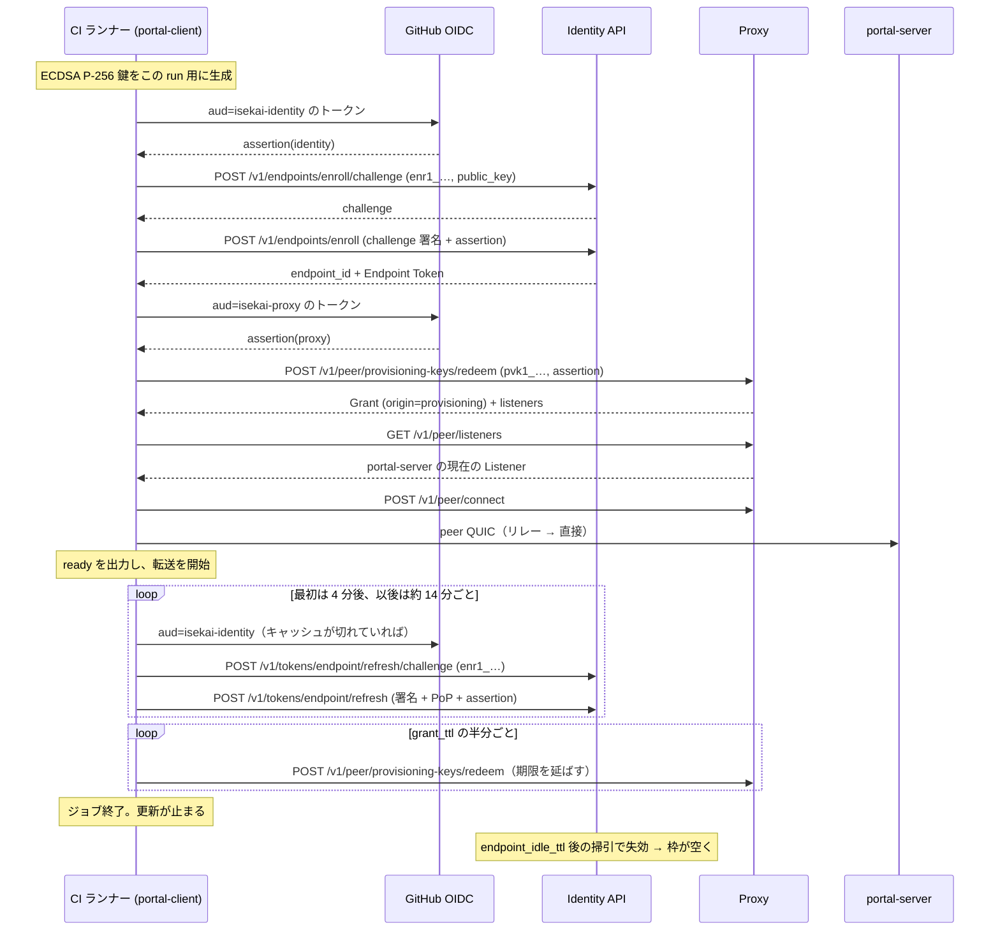

# ISEKAI portal — CI からの無人接続（Enrollment Key / Provisioning Key）

実装計画。対象は `isekai-p2p-core` / `isekai-p2p` / `portal-core` / `portal-client` /
`portal-server` / `.github/workflows` と `docs/portal.md`。

根拠は **P2P Connect 仕様 §8.8（Enrollment Key API）** と
**ISEKAI Link Server 仕様 §8.13（Provisioning Key API）**。以下、前者を「Identity 仕様」、
後者を「Proxy 仕様」と書く。

> **節番号の読み方。** 番号だけのものは Identity 仕様である。**§8.7〜§8.12 は両仕様に
> 同じ番号があるので、Proxy 仕様のほうは必ず「Proxy 仕様 §…」と明記する** — たとえば
> Grant を定めているのは Proxy 仕様 §8.8 で、Enrollment Key を定めているのは
> Identity 仕様 §8.8 である。§8.13 は Proxy 仕様にしかない。
>
> **改訂 2。** `/code-review high` の指摘を反映した。更新の間隔（§1.3 / §4.2）、
> `OnceLock` の型（§2.3）、枠を返す位置（§2.5）が事実として誤っていた。§8 に一覧がある。
>
> **改訂 1（上流の回答を反映）。** 初版が §7 に挙げた未解決 2 件は
> [ISEKAI-identity#32](https://github.com/seera-networks/ISEKAI-identity/pull/32) で解決した。
> **ジョブは自分で枠を返せる**ようになり（§4.6）、**`refresh/challenge` に assertion は要らない**
> ことが仕様に明記された（§2.1）。枠の見積もりと推奨値（§4.6 / §6.3）、`portal-client` の
> 終了経路（§2.5）、フェーズ 1 と 5 の受け入れ条件がそれぞれ変わっている。

---

## 0. 何を決めたか

CI のジョブが、人の操作なしに **自分の Endpoint を作り、portal-server に到達する認可を得て、
ローカルポートを転送する**ところまでを 1 コマンドで走らせられるようにする。

要るのは **2 本の鍵**で、発行するサーバも、失効させるサーバも違う。

| # | 塞ぐ穴 | 鍵 | 発行元 | 前置 |
| --- | --- | --- | --- | --- |
| **P1** | CI ランナーには Endpoint が無い。§4.3 の登録は Auth0 認証状態を要求する | **Enrollment Key** | Identity API | `enr1_` |
| **P2** | Endpoint はあるが、毎回 owner が Ticket を出せない | **Provisioning Key** | Proxy | `pvk1_` |

**片方だけでは用を成さない。** P1 だけなら Endpoint は生えるが誰にも繋げない。P2 だけなら
対象は「一度人手で登録した長寿命ランナー」に限られる。CI のシークレットには **2 本入れる**
（Identity 仕様 §8.8.1 / §8.8.12）。

```text
Enrollment Key (Identity)          Provisioning Key (Proxy)
  ↓ 無人で Endpoint を作る            ↓ 無人で Grant を作る
ep:CI が生える                     ep:CI が portal-server の Listener に到達できる
```

決めたことは 5 つ。

1. **既存の Auth0 経路は残す。** 無人経路は代替であって置き換えではない。`P2pConfig` の
   認証部分を列挙型（§2.3）にして、どちらを使っているかが型で読めるようにする。
2. **assertion は「1 本もらう」のではなく「毎回鋳造する」。** これは利便ではなく、
   Identity 仕様 §8.8.7 が更新のたびに `binding` の検証を要求していることの帰結である（§4.2）。
3. **秘密は argv に載せない。** 鍵は環境変数かファイルから読む（§4.1）。
4. **CI では鍵ペアを毎回生成する。** 1 鍵 = 1 Endpoint なので、使い回すと 2 回目のジョブが
   `409 endpoint-already-registered` で落ちる（§4.4）。
5. **ジョブは出るときに枠を返す。** 掃引は保険であって片付けの主経路ではない（§4.6）。
   これは改訂 1 で足した。上流が自己失効を用意したので、枠の見積もりが「累積」から
   「並列度」に変わっている。

---

## 1. いま何ができていて、何ができていないか

### 1.1 いま CI が抱えている問題

`.github/workflows/ios-ffi.yml` は Identity/Proxy を使う唯一の統合テストを持っており、
そこにこう書いてある。

> An Auth0 access token for the live Identity/Proxy. […] Access tokens expire, so this
> needs periodic refreshing — **minting one from machine-to-machine credentials would be
> the durable fix.**

本計画はその「durable fix」である。ただし Auth0 の M2M ではなく、仕様が定めた
Enrollment Key を使う。Auth0 の M2M クレデンシャルは Identity API の系統 A に
そのまま流し込めるが、それは「Auth0 を迂回する口を自前で開ける」ことに等しく、枠も
`binding` も派生 Endpoint の掃引も付いてこない。

### 1.2 実装済み

| 仕様 | 実装 |
| --- | --- |
| §8.1.1 / §8.1.2 登録 | `isekai_p2p_core::identity::{register_challenge, register}` |
| §8.2.1 Endpoint Token 発行 | `identity::issue_token`（PoP つき） |
| Proxy 仕様 §8.9 ペアリング | `proxy::pair_with_code` / `pair_with_listener` |
| Proxy 仕様 §8.12 Ticket | `proxy::{create_ticket, list_tickets, revoke_ticket, redeem_ticket}` |
| Proxy 仕様 §8.10 到達可能な Listener | `proxy::list_reachable_listeners` |
| 接続 | `portal_core::session::{Reach, connect}` |
| トークンの更新ループ | `isekai_p2p::config::spawn_token_renewal` |

### 1.3 未実装 — ここが工数の本体

| 仕様 | 内容 | 備考 |
| --- | --- | --- |
| §8.2.2 / §8.2.3 | 更新用 Challenge と **更新** | **これが無いと無人経路が 15 分で死ぬ** |
| §8.8.2 / §8.8.9 | Enrollment Key の発行・一覧・登録記録・失効 | 系統 A（Auth0 AT、PoP 無し） |
| §8.8.4 / §8.8.5 | 無人 Challenge と無人登録 | `Authorization` を持たない第 3 の経路 |
| §8.8.7 | Enrollment Key による更新 | §8.2.2 / §8.2.3 の変種 |
| §8.7 | 失効。**Enrollment Key + PoP でも呼べる** | 改訂 1。有人経路とは必須項が違う |
| Proxy 仕様 §8.13.3 / §8.13.7 | Provisioning Key の発行・一覧・引き換え記録・失効 | 系統 B |
| Proxy 仕様 §8.13.5 | 引き換え | 系統 B、`assertion` つき |

**ここで一番効く事実**: 現在の更新ループは §8.2.1（**発行**）を呼び直しているが、
**§8.2.1 は Auth0 AT を要求する**。無人 Endpoint はそこへ行けない。したがって
**§8.2.2 / §8.2.3 の実装は「あると良い」ではなく、この計画の前提条件**である。
§8.8.7 が「更新できなければ、無人登録は最長 15 分しか持たない」と書いているのは
このことである。

**間隔は 4 分ではない。** `renew_delay`（`rust/isekai-p2p/src/config.rs`）は
`expires_in − 60 秒`（下限 30 秒）を返し、240 秒の `RENEW_UNKNOWN` は
**寿命が分からないときだけ**の値である。`spawn_token_renewal` の 3 か所の呼び出しは
いずれも初期値として `None` を渡すので、実際の刻みはこうなる。

```text
t=0        トークン取得（expires_in = 900）
t=240s     1 回目の更新   ← 初期値が None なので RENEW_UNKNOWN
t=240+840s 2 回目以降     ← renew_delay(Some(900)) = 840 秒 = 14 分
```

**この数字は §4.2 の結論を弱めるどころか強める。** 定常の間隔 14 分は、GitHub の
ID トークンの寿命（5〜15 分）と同じ桁かそれより長い。assertion を使い回す余地は
実質的に無い。

### 1.4 触らないと決めたもの

- **Initiator 側は ACME 証明書を注文しない。** `portal_core::session` で
  `endpoint_cert::issue` を呼ぶのは `serve`（portal-server）だけで、`connect` は
  `endpoint_cert::dev_cert` の側を通る。したがって CI が毎回新しい Endpoint を作っても、
  `ios-ffi.yml` が警戒している Let's Encrypt の週 50 通の枠は消費しない。
  **portal-server を CI で立てる場合は話が別で、そちらは鍵をピン留めしたまま残す。**
- `Reach` に列挙子は足さない（§2.5）。

---

## 2. 責務の割り当て

### 2.1 `isekai-p2p-core::identity`

**責務: Identity API の経路を 3 系統に増やす。**

いまこのモジュールが持っている暗黙の前提は「すべての要求は `Authorization: Bearer
<auth0_at>` を持つ」であり、`post_bytes` はそれを無条件に組み立てている。無人経路は
**`Authorization` ヘッダを持たず、資格情報をボディに置く**（Identity 仕様 §8.8.4）ので、
ここを分ける。

1. **認証の型を導入する。**

   ```rust
   /// Identity API に対する「私は誰か」の言い方。
   pub enum IdentityAuth<'a> {
       /// 系統 A。`Authorization: Bearer`。
       Auth0(&'a str),
       /// 第 3 の資格（§8.8.4）。`Authorization` を持たず、ボディに載る。
       /// `assertion` は `binding.type` が `oidc` のときのみ。
       Enrollment { key: &'a str, assertion: Option<&'a str> },
   }
   ```

   `post_bytes` は `IdentityAuth` を取り、`Auth0` のときだけヘッダを付ける。
   ボディへの差し込みは呼び出し側でやる（署名対象のバイト列が確定してから PoP を作る
   必要があるため、いまの `issue_token` と同じ順序を守る）。

2. **§8.2.2 / §8.2.3 を実装する。**

   ```rust
   pub async fn refresh_challenge(&self, auth: IdentityAuth<'_>, endpoint_id: &str)
       -> Result<Challenge, IdentityError>;
   pub async fn refresh_token(&self, auth: IdentityAuth<'_>, key: &EndpointKey,
                              challenge: &Challenge, ttl: Option<i64>)
       -> Result<EndpointToken, IdentityError>;
   ```

   - 署名対象は `challenge ‖ endpoint_id ‖ timestamp`。**既存の `sign_challenge` が
     そのまま使える**（§8.8.5 も同じ対象である旨が仕様に明記されている）。
   - PoP は `Auth0` でも `Enrollment` でも必須。置き換わるのは Auth0 認証状態の側だけで、
     「Endpoint 秘密鍵の所持」は変わらない（§8.2.3 の但し書き、§8.8.7）。
   - `requested_permissions` / `requested_protocols` は **渡さない**。更新は
     「現在の天井 ∩ 直前のトークン」に単調に縮むのが仕様の既定で、明示するのは
     さらに絞りたいときだけである。
   - **`refresh_challenge` に assertion は渡さない。** ボディは
     `{ endpoint_id, enrollment_key }` だけである。`binding` を見るのは §8.2.3 のみで、
     両方で要求するとその間に OIDC トークンが切れる余地を無駄に作る（§8.8.4 と同じ判断）。
     **したがって更新 1 回あたりの鋳造は 1 回で足りる。**

3. **§8.8.4 / §8.8.5 を実装する。**

   ```rust
   pub async fn enroll_challenge(&self, enrollment_key: &str, key: &EndpointKey)
       -> Result<Challenge, IdentityError>;
   pub async fn enroll(&self, auth: IdentityAuth<'_>, key: &EndpointKey,
                       challenge: &Challenge, device_name: Option<&str>, ttl: Option<i64>)
       -> Result<Enrolled, IdentityError>;
   ```

   `Enrolled` は登録と最初のトークンを 1 往復で運ぶ（§8.8.5）。

   ```rust
   pub struct Enrolled {
       pub endpoint_id: String,
       pub endpoint_token: String,
       #[serde(default)] pub expires_in: Option<i64>,
       #[serde(default)] pub device_id: Option<String>,
       #[serde(default)] pub tenant_id: Option<String>,
       #[serde(default)] pub enrollment_key_id: Option<String>,
       #[serde(default)] pub ephemeral: Option<bool>,
       #[serde(default)] pub expires_at: Option<String>,
       #[serde(default)] pub permissions: Vec<String>,
       #[serde(default)] pub protocols: Vec<String>,
   }
   ```

   **必須は 2 つだけで、残りは省略可にする。** `Ticket` と `Grant` が同じ形をしているのと
   同じ理由であり、ここではその理由が一段強い。パースに失敗した登録応答は、
   **枠を 1 つ消費し、Challenge を消費し、しかもその鍵ペアは二度と登録できない**
   （1 鍵 = 1 Endpoint、以後 `409`）。`device_id` が欠けていることに払う代償ではない。

4. **§8.8.2 / §8.8.9 を実装する**（Enrollment Key の発行・一覧・登録記録・失効）。
   系統 A のみ。PoP は付けない（呼び出し元は人であって Endpoint ではない）。

5. **§8.7 の失効を、Enrollment Key でも呼べるようにする。**

   ```rust
   pub async fn revoke_endpoint(&self, auth: IdentityAuth<'_>, key: &EndpointKey,
                                endpoint_id: &str, reason: Option<&str>, note: Option<&str>)
       -> Result<Revoked, IdentityError>;
   ```

   `IdentityAuth::Enrollment` のとき、**更新（§8.8.7）とまったく同じ組**（鍵 + PoP）だが
   **2 点だけ違う**。

   - **`assertion` は渡さない。** `binding` が答えているのは「この鍵で何かを*得て*よいのは
     誰か」であり、失効は何も得ない。**止める側の要求を進む側より重くしない** — ジョブが
     異常終了して OIDC トークンを鋳造できない場面でこそ枠を返してほしい。
     したがって `Enrollment { assertion: None }` で呼ぶのが正しく、
     手元に assertion があっても付けない。
   - **`reason` は渡せない。** Identity が `enrollment_released` を付ける。有人経路の
     `reason` は引き続き必須なので、`Auth0` と `Enrollment` で必須項が入れ替わる —
     型で分けずに `Option` 1 つで通すと、有人経路の `reason` 忘れが `400` になって初めて
     分かる。

   **この経路だけ `RevokeAuth` を別に持つ**（実装で決めた。改訂 2 は
   「`IdentityAuth::Auth0` へ入れる」と書いていたが、`IdentityAuth` は登録・発行・更新が
   共有する型なので、そこへ `reason` を積むと関係の無い経路まで持たされる）。

   ```rust
   pub enum RevokeAuth<'a> {
       Auth0 { token: &'a str, reason: RevokeReason },
       Enrollment { key: &'a str },
   }
   ```

   `RevokeReason` も列挙型にする。語彙は閉じており、しかも**半分は呼び出し元のもので
   はない** — `enrollment_idle` / `enrollment_key_revoked` は Identity が書く理由で、
   要求に書くと弾かれる。応答と一覧には載るが要求には載らないので、この型には無い。

   できるのは**自分を止めることだけ**である（PoP がその Endpoint の秘密鍵を要求する）。
   漏れた鍵だけでは、同じ鍵で生やした別の Endpoint も、有人登録の Endpoint も止められない。

6. **エラーの一様性を潰さない。** `403 enrollment-key-invalid` は未知・期限切れ・失効・
   owner 失効を区別しない。クライアント側で「鍵が期限切れでは？」と推測して表示しない。
   ただし **`429 enrollment-slots-exhausted` は区別して見せる** — 仕様がそこだけ
   例外にしているのは、CI のログから「鍵が悪いのか混んでいるのか」を切り分けるためである。

7. **`Retry-After` を返り値に載せる。** `IdentityError::Api` に `retry_after: Option<Duration>`
   を足す。§8.8.6 は `Retry-After` に掃引の遅れを足した値を載せると定めており、それを
   無視して自前の間隔で再試行するクライアントは必ず 2 度目の `429` を受ける。

### 2.2 `isekai-p2p-core::proxy`

**責務: §8.13 を、Ticket と同じ形で足す。**

1. 型を足す: `ProvisioningKey`（発行応答、`key` のみ必須）、`ProvisioningKeyRecord`（一覧）、
   `Redemption`（引き換え記録）、`RedeemedProvisioning { grant, listeners }`。
   最後は `RedeemedTicket` と同一の形なので、**内部表現を共有する**。
2. メソッドを足す。

   ```rust
   pub async fn create_provisioning_key(&self, protocol: &str, ttl: Option<u64>,
       grant_ttl: Option<u64>, max_live_grants: Option<u32>,
       binding: Option<&Binding>, label: Option<&str>) -> Result<ProvisioningKey, ProxyError>;
   pub async fn list_provisioning_keys(&self) -> Result<Vec<ProvisioningKeyRecord>, ProxyError>;
   pub async fn provisioning_redemptions(&self, key_id: &str) -> Result<Vec<Redemption>, ProxyError>;
   pub async fn revoke_provisioning_key(&self, key_id: &str) -> Result<(), ProxyError>;
   pub async fn redeem_provisioning_key(&self, key: &str, assertion: Option<&str>,
       label: Option<&str>) -> Result<RedeemedProvisioning, ProxyError>;
   ```

3. `Grant` に `provisioning_key_id: Option<String>` を足す（`origin` が `provisioning` の
   ときだけ載る）。`origin` の doc コメントに `provisioning` を追記する。
4. **`redact_tickets` を `redact_secrets` に広げる。** いまは `tkt1_` / `iskt1_` だけを
   伏せているが、`enr1_` と `pvk1_` は**同じ用途で同じ危険**を持つ。前置が固定なのは
   まさにこの検索のためだと両仕様が書いている。呼び出しは `portal-client` に 1 か所。
5. **`Retry-After` を `ProxyError` に載せる**（§8.13.5 の枠と §8.13.6 の `503`）。

### 2.3 `isekai-p2p::auth` / `isekai-p2p::config`

**責務: 資格情報の継ぎ目を 1 か所にする。ここが本計画で唯一の破壊的変更である。**

1. **`P2pConfig` の認証 2 フィールドを列挙型に置き換える。**

   ```rust
   pub enum Credential {
       /// 系統 A。いまある経路。
       Auth0 {
           token: String,
           source: Option<Arc<dyn Auth0TokenSource>>,
           /// **ここへ移す。** §8.1 の登録は Auth0 認証状態を要求するので、
           /// これは系統 A だけの選択肢である。
           register: bool,
       },
       /// §8.8。無人の経路。
       Enrollment(Enrollment),
   }

   pub struct Enrollment {
       /// `enr1_…`。
       pub key: String,
       /// `binding.type` が `oidc` のとき必須。audience ごとに鋳造する。
       pub assertion: Option<Arc<dyn AssertionSource>>,
       /// **登録は 1 プロセスに 1 回だけ。** 下記。
       enrolled: Arc<tokio::sync::OnceCell<String>>,
   }
   ```

   `P2pConfig` から `auth0_token` / `auth0` / **`register`** が消え、
   `credential: Credential` が入る。構築箇所は **13 か所**（camera 系、FFI、agent、
   portal 両側、テストと例）あるが、`Credential::auth0(token, source, register)` の
   コンストラクタを置けば各所 1 行の機械的な差分になる。

   **`register` を上に残さない。** 残すと「無人経路では黙って無視されるフィールド」が
   できる — 本節が `enrollment: Option<…>` を退けたのとまったく同じ形の欠陥である。
   `P2pConfig` は全フィールドが公開のプレーンな構造体で、構築は 13 か所すべてが
   構造体リテラルなので、**「構築時に弾く」場所はそもそも存在しない**。型で消す。

   > **`enrollment: Option<…>` を足すだけにしない。** そのほうが差分は小さいが、
   > 「Auth0 の 2 フィールドが黙って無視される設定」が表現できてしまう。それは数手先の
   > `401` として現れ、原因の側を何も指さない。この repo が `--map` の protocol を
   > 推測せずに言わせているのと同じ判断である。

2. **`enrolled` は共有状態でなければならない。** `P2pConfig` は `Clone` で、更新ループは
   クローンを持って走る。ここが値だと、クローンした側が 2 度目の登録を試み、
   **同じ鍵ペアなので必ず `409` で落ちる**。`auth0: Option<Arc<dyn Auth0TokenSource>>` が
   既に `Arc` を持っているのと同じ理由である。

   **`std::sync::OnceLock` では足りない。** 初期化子が同期のクロージャなので、
   「未登録なら登録する」は `.await` を跨いだ check-then-act になる。`issue_endpoint_token`
   の呼び出しは 13 か所あり、更新タスクは他の呼び出しと**並行に走る**ので、2 つが
   空のセルを見て**両方が enroll を打つ**。負けたほうが受け取る `409` は §4.4 のとおり
   回復不能で、しかも枠は空かない。**`tokio::sync::OnceCell::get_or_try_init` を使う**
   （失敗を憶えないので、一時的な `503` のあと次の呼び出しが再試行できる）。

3. **`AssertionSource` を足す。** `Auth0TokenSource` の隣、同じ形。

   ```rust
   pub trait AssertionSource: Send + Sync {
       /// `audience` 向けのワークロード ID トークンを、いま有効な形で返す。
       fn assertion(&self, audience: &str)
           -> Pin<Box<dyn Future<Output = anyhow::Result<String>> + Send + '_>>;
   }
   ```

   **`audience` を引数に取るのが要点である。** Identity の既定は `isekai-identity`、
   Proxy の既定は `isekai-proxy` で、**両仕様は意図的に別の値にしている**。1 本のトークンを
   使い回す設計にすると、片方に出したトークンが他方で通ってしまう構造を自分で作ることに
   なる。

   実装は 2 つ。

   | 実装 | 取り方 |
   | --- | --- |
   | `GithubActionsOidc` | `ACTIONS_ID_TOKEN_REQUEST_URL` に `&audience=` を付けて GET し、`ACTIONS_ID_TOKEN_REQUEST_TOKEN` を bearer にする。ワークフローに `permissions: id-token: write` が要る |
   | `TokenFiles` | audience → パスの対応表。呼ばれるたびに読み直す（Kubernetes の projected SA トークンはその場で差し替わる） |

   **キャッシュは置かない。** 更新の定常間隔は 14 分（§1.3）で、GitHub の ID トークンは
   5〜15 分しか生きない。**次の更新の時点でほぼ確実に切れている**ので、キャッシュは
   当たらず、当たらないキャッシュは「期限切れのトークンを掴む経路」を 1 本増やすだけである。
   呼ばれるたびに鋳造する。`TokenFiles` も同じ理由で毎回読み直す。

4. **`issue_endpoint_token` を分岐させる。**

   ```text
   Credential::Auth0       → いまと同じ（register ? §8.1 → §8.2.1）
   Credential::Enrollment  → 未登録: §8.8.4 → §8.8.5（登録と最初のトークンが 1 往復）
                             登録済: §8.2.2 → §8.2.3（毎回 assertion を鋳造し直す）
   ```

   `register` が `Credential::Auth0` の中にあるので、**無人経路では書きようがない**。
   無人経路の登録は選択肢ではなく最初の一歩であり、それを言うのに実行時の検査は要らない。

5. **`spawn_token_renewal` は変えない。** いまも `issue_endpoint_token(&cfg)` を呼ぶだけで、
   分岐は 4 の中にある。`renew_delay` / `retry_delay` もそのまま使える。

   **ただし `expires_in` の欠落を決めておく。** §2.1 の `Enrolled` は `expires_in` を
   省略可にしているのに、更新ループは `renew_delay(Some(token.expires_in))` を通る
   （`EndpointToken` の側は `i64`）。**欠けていたら 300 を入れる** — §8.2.1 が
   `ttl` を 300〜900 にクランプしているので、300 は「分かっていないときの最悪ケース」で
   あり、`renew_delay(Some(300))` は 240 秒、すなわち `RENEW_UNKNOWN` と同じ値になる。
   **0 を入れてはならない**: `renew_delay` の下限 30 秒に落ち、ジョブのあいだ 30 秒ごとに
   更新を打ち続ける。
   ただし **更新の成功が `ephemeral` の「最終利用」を押し上げる**（§8.8.8）ことは
   コメントに書く — この更新ループが止まった瞬間から `endpoint_idle_ttl` の時計が
   動きはじめる、というのが CI の枠の返り方そのものである。

### 2.4 `portal-core`

**責務: Grant を保つ。**

`session::connect` と `Reach` は変えない（§2.5）。足すのは 1 つ。

```rust
/// 引き換えた Grant を、鍵が生きているあいだ更新しつづける。
pub fn keep_the_grant(directory: Arc<PeerDirectory>, key: String,
                      assertion: Option<Arc<dyn AssertionSource>>,
                      expires_at: Option<String>, shutdown: CancellationToken) -> GrantKeeper;
```

- **なぜ要るか。** `grant_ttl` の既定は 1,800 秒で、上限は 3,600 秒である（Ticket の
  86,400 より意図的に狭い）。**その狭さは再引き換えで延びることを前提にしている**
  （Proxy 仕様 §8.13.5）。1 時間を超える CI ジョブは、これが無いと途中で認可を失う。
- 期限の半分、または `expires_at − 5 分` の早いほうで再引き換えする。応答は `200` で、
  期限は `max(既存, now + grant_ttl)` に延びる。
- **再引き換えにも assertion が要る**（`binding.type` が `oidc` なら毎回）。§4.2 と同じ話が
  Proxy 側にも立つ。
- 失敗はセッションを落とさない。トークン更新と同じで、いまの Grant は期限まで効いている。
  `retry_delay` と同じ後退で再試行する。
- **枠は増えない。** 同じ Endpoint の再引き換えは同じ 1 枠であり、しかも更新は
  枠が埋まっていても通る（§8.13.5）。

### 2.5 `portal-client`

**責務: CI の 1 コマンド。**

新しいフラグ。

| フラグ | 意味 |
| --- | --- |
| `--enroll` | 環境の Enrollment Key で無人登録する。**明示のスイッチ**であり、環境変数の有無で暗黙に切り替えない |
| `--enrollment-key-file <path>` | 既定は環境変数 `ISEKAI_ENROLLMENT_KEY` |
| `--provisioning-key-file <path>` | 既定は環境変数 `ISEKAI_PROVISIONING_KEY` |
| `--oidc <github\|files\|none>` | assertion の出どころ。既定 `none` |
| `--oidc-token-file <aud>=<path>` | `--oidc files` のとき。繰り返し可 |
| `--issue-enrollment-key` ほか | 鍵の発行・一覧・登録記録・失効（§2.6 と対になる、owner 側の操作） |

**秘密を取るフラグは置かない。** `--enrollment-key <値>` は作らない（§4.1）。

制御フローは既存の `--pair` / `--redeem` の並びに素直に入る。

```text
--pair <code>        → pair_with_code        ┐
--redeem <ticket>    → redeem_ticket         ├ どれも「入れてもらう」で、
--provisioning-key…  → redeem_provisioning   ┘ 返るのは owner の Endpoint ID
                                               → 続けて --map があればそのまま接続
```

すなわち `Reach` に列挙子は要らない。引き換えは接続の前段で済み、そのあとは
既存の `Reach::Grant { peer }` がそのまま働く — **これは偶然ではなく、Grant が
Listener を鍵に含まないという Proxy 仕様 §8.8 の設計の帰結**である。

加えて 2 つ。

- **`--enroll` と保存済みサインインの併用を弾く。** どちらの資格で立っているのかが
  読めない状態を作らない。
- **すべての転送を bind し終えたら `ready` を 1 行 stdout に出す。** CI の待ちループが
  掴む点が要る。`camera-core` の `synthetic_server` が同じことをしていて、
  `ios-ffi.yml` はそれを `grep -q '^ready$'` で待っている。
- **出るときに枠を返す**（§2.1 の 5）。置く場所は **`main` の中、`run` が返ったあと、
  `portal_core::shutdown::leave` の手前**である。

  > **`connected.close()` の隣ではない。** `run` は登録が済んだあとにも複数の経路で
  > 抜ける — `--map` が無いときの `return Ok(())`、`session::connect` の `?`、
  > `start_forwards` が失敗したときの `return Err(e)`。`connected.close()` の隣に
  > 置くと、そのどれもが枠を持ち逃げする。**転送が始まる前に落ちた run こそ、
  > 枠を返してほしい run である**（§4.6 / §2.7 が言っているのと同じこと）。
  > `run` が返す値に関わらず 1 回だけ打つ。
  - **失敗しても終了コードを変えない。** 掃引という保険が後ろにあり、転送は成功していた
    のだから、片付けの失敗を仕事の失敗として報告しない。`warn!` で言うだけにする。
  - **締切を付ける**（3 秒程度）。ここで待つのは終了を遅らせるだけの往復であり、
    Identity が黙っているときに CI のジョブを引き延ばす理由が無い。
  - **`--enroll` のときだけ。** 有人経路の Endpoint は端末の身元であって、
    プロセスの終了で消してよいものではない。

**そして SIGTERM を捕まえる。** いまの `tokio::select!` は `tokio::signal::ctrl_c()`
= SIGINT だけを見ており、**ワークスペースのどこも SIGTERM を扱っていない**。CI が
`kill <pid>` で止めると既定の処理で即座に死に、**上の失効は一度も走らない** —
枠を返す経路を足しても、CI がそれを呼ばない形になる。Unix では
`signal::unix::SignalKind::terminate()` を同じ腕に足す。

> **捕まえたら、逃げ道も塞ぎ直す。** `shutdown::hard_exit_on_second_interrupt` が
> 再武装するのは **SIGINT だけ**である。TERM を捕まえた以降、失効の 3 秒や
> `leave` の msquic ドレイン中に届いた 2 度目の TERM は飲み込まれる。
> ハッチにも TERM を足す（`kill -KILL` に頼るのは §2.7 の後始末だけで、
> ジョブのキャンセルやコンテナの停止はそこを通らない）。

### 2.6 `portal-server`

**責務: Provisioning Key を出す側。**

`--ticket` / `--tickets` / `--revoke-ticket` と完全に並行な 4 つを、同じ
`grant_admin` の上に足す。

| フラグ | 対応 |
| --- | --- |
| `--provisioning-key` | Proxy 仕様 §8.13.3 発行。`--provisioning-ttl` / `--grant-ttl` / `--max-live-grants` / `--provisioning-label` / `--binding-oidc <issuer>` / `--binding-subject <subject>` |
| `--provisioning-keys` | §8.13.7 一覧（`live_grants` と `redemption_count` つき） |
| `--provisioning-redemptions <id>` | §8.13.7 引き換え記録。**誰が入ったか**を後から辿る唯一の口 |
| `--revoke-provisioning-key <id>` | §8.13.7 失効。**派生 Grant も消える** |

失効の出力は `--revoke-ticket` と**逆のことを言わなければならない**。Ticket の失効は
「入った人は出ていかない」だが、Provisioning Key の失効は派生 Grant を消す
（Proxy 仕様 §8.13.7 が意図的に反転させている）。走行中のジョブが落ちる、と出力に書く。

**前提**: 発行には新しい permission `peer-provisioning:create` が要る
（Proxy 仕様 §8.13.2）。`peer-connect:accept` では発行できない。

> **これは現在ブロックされている。** Identity は `peer-provisioning:create` を
> **発行できない** — 仕様 §7 の権限表にも、実装の `Permission` 列挙型にも無い。
> §9.2 を読むこと。**このフェーズは上流が対応するまで着手できない。**

### 2.7 CI ワークフロー

`.github/workflows/` に、上記を使う形を 1 つ置く。まずは `portal.yml` の統合ジョブとして。

```yaml
permissions:
  id-token: write        # これが無いと ACTIONS_ID_TOKEN_REQUEST_* が生えない
  contents: read
env:
  ISEKAI_ENROLLMENT_KEY:   ${{ secrets.ISEKAI_ENROLLMENT_KEY }}
  ISEKAI_PROVISIONING_KEY: ${{ secrets.ISEKAI_PROVISIONING_KEY }}
steps:
  - name: Forward the server's ports into this runner
    if: env.ISEKAI_ENROLLMENT_KEY != '' && env.ISEKAI_PROVISIONING_KEY != ''
    run: |
      set -euo pipefail
      LOG="$RUNNER_TEMP/portal-client.log"
      ./target/debug/portal-client \
        --enroll --oidc github \
        --key "$RUNNER_TEMP/ci-endpoint.pem" \
        --device-name "gha-${GITHUB_RUN_ID}" \
        --label "gha-${GITHUB_RUN_ID}-${GITHUB_RUN_ATTEMPT}" \
        --map 15432:db > "$LOG" 2>&1 < /dev/null &
      echo $! > "$RUNNER_TEMP/portal-client.pid"
      for _ in $(seq 1 120); do grep -q '^ready$' "$LOG" && exit 0; sleep 1; done
      cat "$LOG"; exit 1
```

- **`if:` で 2 本とも要求する。** `ios-ffi.yml` が 2 つのシークレットに対して同じことを
  している。半分だけ設定されたリポジトリが枠を静かに食う状態を作らない。
- `./target/debug/portal-client` と書けるのは、`portal.yml` の当該ジョブが
  `defaults.run.working-directory: rust` を置いているからである。**別のジョブへ置くなら
  パスを直す。**
- `--key` は `$RUNNER_TEMP` に置く。**毎回新しい鍵ペアであることが正しい**（§4.4）。
- **止め方は `if: always()` の後始末ステップで、シグナルを送って待つ。**

  ```yaml
  - name: Stop the forward and give the slot back
    if: always()
    run: |
      PID=$(cat "$RUNNER_TEMP/portal-client.pid" 2>/dev/null) || exit 0
      kill -TERM "$PID" 2>/dev/null || exit 0
      for _ in $(seq 1 10); do kill -0 "$PID" 2>/dev/null || exit 0; sleep 1; done
      kill -KILL "$PID" 2>/dev/null || true
  ```

  **`always()` でなければ意味が無い。** 枠を返してほしいのは、テストが落ちて
  ジョブが途中で終わるときこそである。`kill -9` に直行すると失効は走らず、
  掃引まで枠が埋まったままになる（§4.6）。

---

## 3. 全体のフロー



---

## 4. 決めたことと、その理由

### 4.1 秘密は argv に置かない

`--enrollment-key <値>` というフラグは作らない。理由は 3 つあり、どれも単独で十分である。

- Linux では `/proc/<pid>/cmdline` が同一 UID の任意のプロセスから読める。CI ランナーは
  他人のコードを走らせる場所である。
- `set -x` の付いたシェル、失敗したステップのログ、`ps` を撮るデバッグ用ステップ —
  どれも argv をそのまま吐く。
- 既存の `--auth0-token` は同じ問題を持つが、**あれは人が対話で使うもの**で、しかも
  `--login` という代替が既にある。無人経路には対話が無いので、代替を先に決めておく。

読み方は 2 つだけ: 環境変数（既定）と、ファイル（`--*-key-file`）。ファイルから読むときは
末尾の改行を落とす。

### 4.2 assertion は毎回鋳造する

**「ジョブの頭で 1 本取って渡す」では動かない。** Identity 仕様 §8.8.7 は
`binding` を**更新のたびに**検証すると定めており、しかもそれは緩められる制限ではなく、
`oidc` の鍵が「ジョブが終われば更新できなくなる」という**歯止めそのもの**である。
更新は最初の 1 回が 4 分後、以後およそ 14 分ごとに走り（§1.3）、GitHub の ID トークンは
5〜15 分で切れる。**定常の間隔のほうが長いので、1 本渡しは 2 回目の更新でもう切れている。**

したがって `AssertionSource` は「値」ではなく「取り方」を持つ。§2.3 の 3 を参照。

同じ理由で、§8.8.3 が **`iat` に PoP と同じ ±60 秒を課してはならない**と書いていることを
クライアント側でも守る: 後退再試行（`429` / `503` の `Retry-After`）のあと、手元の
assertion は 60 秒より古い。それを「古いから捨てる」と判断してはならない。判断するのは
`exp` である。

### 4.3 audience は 2 つある

Identity は `isekai-identity`、Proxy は `isekai-proxy`。**揃えるのは運用者の設定であって
クライアントの都合ではない。** `AssertionSource::assertion(audience)` が audience を
取るのはこのためで、`--oidc files` のときも audience → パスの対応で持つ。
1 本を両方に使い回す近道を API の形で塞ぐ。

### 4.4 CI では鍵ペアを毎回作る

1 鍵 = 1 Endpoint（§8.8.6）。同じ鍵ペアで 2 度目を登録すると `409
endpoint-already-registered` で、しかも**枠は空かない**。したがって使い捨てランナーは
毎回新しい鍵ペアを作る — それは前提であって、回避すべき無駄ではない。

**これは `ios-ffi.yml` が `ENDPOINT_KEY_PEM` をピン留めしているのと矛盾しない。**
あちらは Listener 側（`synthetic_server`）で、Endpoint ごとに ACME 証明書が要る。
portal-client は Initiator で、証明書を注文しない（§1.4）。**portal-server を CI で
立てるときは、あちらと同じくピン留めする**。

### 4.5 Grant は保持ではなく更新する

§2.4。`grant_ttl` の上限が Ticket より狭いのは再引き換えが効く前提だから、というのが
Proxy 仕様の書きぶりであり、クライアントがそれをやらないと上限の狭さだけが残る。

### 4.6 枠はジョブが返す。掃引は保険である

**初版から変わった箇所である。** 初版は「§8.7 の失効は Auth0 AT を要求するので CI からは
呼べず、掃引を待つしかない」と書き、それを §7 の未解決 1 に挙げた。上流がこれを
解決した（ISEKAI-identity#32）ので、見積もりが変わる。

| | 初版（掃引だけ） | 改訂（自己失効あり） |
| --- | --- | --- |
| `max_live_endpoints` | 並列度 × (実行時間 + `idle_ttl`) / 実行間隔 | **並列度そのもの** |
| `endpoint_idle_ttl` | 枠が空くまでの時間そのもの | **呼べなかったときの保険** |

初版の見積もりが痛かったのは、既定（枠 4 / `idle_ttl` 3,600 / 掃引 300）で 5 分の
ジョブを並列 4 で回すと **4 枠が約 1 時間占有され**、詰まるのは「同時 5 本目」では
なく次に来たジョブだった、という点である。約 55 分にわたって
`429 enrollment-slots-exhausted` が返っていた。自己失効を呼べば、枠はジョブの終了と
同時に空く。

**それでも `endpoint_idle_ttl` は短く置く。** 失効が呼ばれないケースは残る —
ランナーの強制終了、`kill -9`、ネットワークが切れたまま終わるジョブ。生きている
ランナーは 15 分に 1 度はトークンを更新するので（§1.3）、1,800 で足りる。

**掃引を主経路にしない。** §2.5 の終了処理と §2.7 の後始末ステップは、どちらもこの
ためにある。返せるはずの枠を掃引に任せると、`idle_ttl` を短くするしかなくなり、
今度は更新が数回続けて失敗しただけのランナーが落ちる。

### 4.7 一様な `403` を、そのまま見せる

`403 enrollment-key-invalid` と `403 provisioning-key-invalid` は、未知・期限切れ・失効を
区別しない。**クライアントが推測して補ってはならない** — それをやると、拾った鍵の状態を
問い合わせる口をクライアント側に再実装したことになる。

区別して見せてよいのは仕様が区別しているものだけ:

| 応答 | 見せ方 |
| --- | --- |
| `403 …-key-invalid` | 「この鍵では通らない」。理由は言わない。**両方のサーバの鍵を確認するよう促す**（どちらの鍵かはメッセージで区別できる） |
| `403 enrollment-binding-invalid` / `provisioning-binding-invalid` | **鍵は有効。設定が違う。** ブランチ・リポジトリ・audience を疑う旨を出す |
| `429 …-slots-exhausted` | 混んでいる。`Retry-After` に従う |
| `503 …-unavailable` | 発行者の JWKS が引けない。後退して再試行 |

`binding-invalid` を `key-invalid` に畳み込まないのは仕様の明示的な判断であり、
**運用者が「鍵が漏れたのか設定を間違えたのか」を切り分けられるかどうか**がそこで決まる。

### 4.8 設定の不整合は、踏む前に言う

Identity 仕様 §8.8.10 が「運用で最も踏まれる」と書いているもの。Identity は Proxy 側の
鍵の設定を知らないので検証できない。できるのは 2 つ。

- 発行応答の `warnings` を **そのまま出力に出す**（`peer-connect:initiate` が無い、
  `protocols` が空、`binding.type` が `none`）。
- `portal-client --issue-enrollment-key` の出力に、**次に確認すべきこと**を書く:
  Provisioning Key の `protocol` がこの鍵の `protocols` に入っているか、
  `binding` の `issuer` / `subject` が両者で一致しているか。

---

## 5. フェーズ

### フェーズ 0 — サーバ側の前提を確認する（実装なし）— **実施済み。§9 に結果**

これが無いと以降のすべてが `404` か `403` になり、しかもクライアントのログは
その理由を言わない。

1. Identity の配備で `ENROLLMENT_KEYS_ENABLED=1` か（既定は無効で、全経路が `404`）。
2. `ENROLLMENT_OIDC_ISSUERS` に `https://token.actions.githubusercontent.com` があるか。
3. `ENROLLMENT_OIDC_AUDIENCE` と `--p2p-provisioning-oidc-audience` の実値。
4. Proxy 側に `--p2p-provisioning-oidc-issuer` が設定され、**起動時検証を通っているか**。
5. 運用者の Endpoint の天井に `peer-provisioning:create` があるか（§8.13.2）。
6. Enrollment Key を発行する User の天井に `peer-connect:initiate` と
   `isekai-portal-v1` があるか（鍵は権限を作らない）。

**受け入れ条件**: 上の 6 つが書き取られ、値が `docs/portal.md` の運用節に載っている。

### フェーズ 1 — Identity クライアント — **完了**

§2.1。§8.2.2 / §8.2.3 / §8.8.2 / §8.8.4 / §8.8.5 / §8.8.9 と `IdentityAuth`。

**受け入れ条件**
- `isekai-p2p-core/tests/identity_flow.rs` に倣った axum モックで、
  無人登録の 2 往復と更新の 2 往復が、**送っているヘッダとボディの中身まで**検証される。
  とくに: enroll 系に `Authorization` が**無い**こと、更新に PoP が**ある**こと、
  署名対象が `challenge ‖ endpoint_id ‖ timestamp` であること。
- **`refresh/challenge` の要求に `assertion` が入っていないこと。** 入れても通るが、
  入れないことが仕様の形であり、鋳造 1 回で更新 1 回が回ることの担保である。
- **自己失効の要求に `assertion` も `reason` も入っていないこと**、そして
  `IdentityAuth::Auth0` の失効では `reason` が**必須**であること。
  この 2 つが同じ関数の 2 つの経路であることを、テストが言う。
- `Enrolled` が `endpoint_id` と `endpoint_token` だけの応答をパースできる。
- `429` の `Retry-After` が `IdentityError` に載る。

### フェーズ 2 — 資格情報の継ぎ目

§2.3。`Credential` / `Enrollment` / `AssertionSource` と `issue_endpoint_token` の分岐。
13 か所の構築サイトの移行を含む。

**受け入れ条件**
- `cargo build --workspace` が通る（camera 系・FFI・agent を含む）。
- `tests/token_flow.rs` に無人経路の対を足す: 1 回目が enroll を打ち、
  2 回目以降が refresh を打つこと。**`P2pConfig` をクローンしてから 2 回目を呼んでも
  enroll に戻らないこと** — これが `OnceCell` を共有する理由そのものである。
  **並行に 2 本呼んでも enroll が 1 回しか出ないこと**も見る（`get_or_try_init` が
  効いているかは、逐次のテストでは分からない）。
- `GithubActionsOidc` が audience ごとにキャッシュし、`exp` の手前で捨てる。
  環境変数が無ければ、何を設定すべきか（`permissions: id-token: write`）を名指しで言う。

### フェーズ 3 — Proxy クライアント

§2.2。§8.13 の 5 メソッドと型、`redact_secrets`。

**受け入れ条件**
- 引き換え応答が `RedeemedTicket` と同じ経路でパースされる。
- `redact_secrets` が 4 つの前置すべてを伏せ、最長一致で `iskt1_` を `i` + `tkt1_` と
  読まない（既存テストの拡張）。
- `403 provisioning-binding-invalid` が `provisioning-key-invalid` と別の型として届く。

### フェーズ 4 — `portal-server` の発行系

§2.6。既存の `grant_admin` に 4 フラグ。

**受け入れ条件**
- `--provisioning-key` の出力が、鍵・`key_id`・`expires_at`・`grant_ttl`・`max_live_grants`・
  `binding` を出し、**CI 側に何を設定させればよいか**（audience の実値を含む）を書く。
- `--revoke-provisioning-key` の出力が、派生 Grant も消えること・走行中のジョブが
  落ちることを言う。`--revoke-ticket` の出力と読み比べて矛盾しない。

### フェーズ 5 — `portal-client` の CI 経路

§2.5 と §2.4（`keep_the_grant`）。

**受け入れ条件**
- `--enroll --oidc github --map …` の 1 コマンドで、登録→引き換え→接続→転送まで通る。
- すべての転送が bind されたあとに `ready` が 1 行出る。
- `--enroll` と保存済みサインインの併用、`--enroll` と `--register` の併用が
  引数の段階で弾かれる（ネットワークに何も出す前に）。
- Grant の期限が半分を切ったところで再引き換えが走り、`expires_at` が延びる。
- **SIGTERM で終了経路に入り、枠を返してから出る。** SIGINT でも同じ。
  失効が失敗しても終了コードは変わらず、締切を超えて待たない。
- 有人経路（`--enroll` なし）では失効を**打たない**。
- 失敗の表示が §4.7 の表のとおりに分かれる。

### フェーズ 6 — CI と文書

§2.7 と `docs/portal.md`。

**受け入れ条件**
- ワークフローが、2 つのシークレットが揃っているときだけ走る。
- `docs/portal.md` に「画面を持たないものを入れる」の隣として **「CI から入る」節**が
  加わり、鍵 2 本・audience 2 つ・枠の見積もり・ローテーションの手順が書かれている。
- `docs/portal.md` の失効の節に、Provisioning Key の失効が Ticket と逆であることが載る。

---

## 6. 運用

### 6.1 鍵を作る（1 回だけ）

```console
$ portal-client --login                      # CI の Endpoint を所有する User として
$ portal-client --issue-enrollment-key \
    --binding-oidc token.actions.githubusercontent.com \
    --binding-subject 'repo:<org>/<repo>:ref:refs/heads/main' \
    --protocols isekai-portal-v1 \
    --max-live-endpoints 8 --endpoint-idle-ttl 1800 \
    --enrollment-label gha-main
```

```console
$ portal-server --provisioning-key \
    --binding-oidc token.actions.githubusercontent.com \
    --binding-subject 'repo:<org>/<repo>:ref:refs/heads/main' \
    --grant-ttl 1800 --max-live-grants 8 \
    --provisioning-label gha-main
```

出た 2 本を、リポジトリのシークレット `ISEKAI_ENROLLMENT_KEY` /
`ISEKAI_PROVISIONING_KEY` に入れる。**どちらも二度と取り出せない。**

### 6.2 揃っていなければならないもの（§8.8.10）

| 項目 | Enrollment Key | Provisioning Key |
| --- | --- | --- |
| protocol | `protocols` に `isekai-portal-v1` | `protocol` = `isekai-portal-v1` |
| permission | `permissions` に `peer-connect:initiate` | （引き換え側に追加の権限は不要） |
| `binding.issuer` | 一致 | 一致 |
| `binding.subject` | **完全一致**。ワイルドカード不可 | 同じ値 |
| `binding.audience` | `isekai-identity`（運用者設定） | `isekai-proxy`（運用者設定） |

`subject` が完全一致であることは、**ブランチを跨ぐなら鍵を分ける**ことを意味する。
`refs/heads/main` の鍵で PR のジョブは通らない。それは意図した狭さである。

### 6.3 推奨値

| 設定 | 推奨 | 理由 |
| --- | --- | --- |
| `max_live_endpoints` | **並列度 + 1〜2** | ジョブが枠を返すので累積しない。余裕は失効が呼ばれなかった run のぶん。§4.6 |
| `endpoint_idle_ttl` | 1,800 | **保険**。トークン TTL の 2〜3 倍あれば足りる |
| `grant_ttl` | 1,800 | 再引き換えで延びるので上限 3,600 を指定する理由が無い |
| `max_live_grants` | 並列度に合わせる | 同じ Endpoint の再引き換えは枠を増やさない |
| `ttl`（両方） | 30 日未満。無期限は指定できない | 定期交換で回す |

§6.1 の発行例が `--max-live-endpoints 8` としているのは初版の見積もりに拠るもので、
自己失効を呼ぶなら並列度に合わせて下げてよい。**枠を大きくするのは漏洩時の被害を広げる。**

### 6.4 交換

**鍵そのものの本数のクォータが両方 4 ある**ので停止時間は要らない
（Identity 仕様 §8.8.2 の `ENROLLMENT_KEY_QUOTA` は `(tenant_id, owner_sub)` あたり 4、
Proxy 仕様 §8.13.3 の `--p2p-provisioning-key-quota` は Endpoint あたり 4。どちらも
「交換の窓のあいだ新旧 2 枚が生きられるように 1 ではなく 4 にした」と書いてある）。
`max_live_endpoints` の既定 4 とは**別の数**である — あちらは 1 本の鍵が同時に
生かせる派生 Endpoint の枠で、こちらは持てる鍵の本数である。
新しい鍵を発行 → シークレットを差し替え → 数回のジョブが通るのを確認 → 旧鍵を失効。

**旧鍵の失効は、それぞれ別のことをする。**

- Enrollment Key（`ephemeral: true`）の失効 → 派生 Endpoint も失効する。
  **走行中のジョブが落ちる。静かな時間帯に。**
- Provisioning Key の失効 → 派生 Grant が消える。**走行中のジョブが落ちる。**

引き換え側は、新しい Provisioning Key が旧鍵の作った Grant を**引き取る**
（§8.13.5）ので、「数回のジョブが通るのを確認」が本当に新しい鍵を確認している。

### 6.5 誰が入ったか

```console
$ portal-client --enrollment-key-enrollments enk_…     # どのジョブが Endpoint を作ったか
$ portal-server --provisioning-redemptions pvk_…       # どの Endpoint が入ったか
$ portal-server --grants                               # いま入っているもの
```

記録は鍵より長生きする（両仕様が同じ判断をしている）。鍵を止めるのは漏洩・侵害・退職の
場面であり、まさにその瞬間に「誰が入っていたか」を消してはならない。

**`revoke_reason` を監視の軸に使う。** 登録記録に載る 2 つの理由は、まったく違う事実を
言っている。

| `revoke_reason` | 意味 |
| --- | --- |
| `enrollment_released` | **ジョブが自分で片付けた。** 正常な終わり方 |
| `enrollment_idle` | **誰も片付けなかったので、時間が片付けた。** §2.7 の後始末が走っていない |

後者の比率が上がっているなら、CI が落ち方をしている — テストの失敗そのものより先に、
`if: always()` の後始末ステップか、SIGTERM の扱い（§2.5）を疑う。

---

## 7. 未解決

### 解決済み（ISEKAI-identity#32）

1. ~~**ジョブ終了時に枠を返せない。**~~ **解決。** §8.7 が Enrollment Key + PoP を受理する
   ようになった。`binding` の証拠は要らず（失効は何も得ないので、止める側の要求を進む側
   より重くしない）、`reason` は Identity が `enrollment_released` を付ける。
   できるのは自分を止めることだけである。§2.1 の 5 / §2.5 / §4.6 / §6.5 に反映した。
2. ~~**`refresh/challenge` に assertion が要るか。**~~ **解決。要らない。** §8.8.4 と同じ
   判断で、両方で要求すると間に OIDC トークンが切れる余地を無駄に作る。実装は最初から
   そうなっていて、仕様の側が黙っていた。§8.8.7 に要求例つきで明記された。
   **フェーズ 1 は鋳造 1 回 / 更新 1 回で組める。**

### 残り

3. **引き換え応答の `listeners` を使うか。** §8.13.5 は Grant と一緒に Listener を返すので、
   直後の `list_reachable_listeners` は省ける。ただし `TicketListener` と同じくスキーマが
   緩く、`choose_listener` は `ReachableListener` を取る。1 往復を惜しむために型を
   2 つ通すかどうかは、実装時に測って決める。
4. **`--oidc files` の対応表の書式。** `<aud>=<path>` の繰り返しにしたが、Kubernetes の
   projected volume は audience ごとに別のボリュームを要求するので、実際に置く人が
   どう書きたいかは分かっていない。最初の利用者が決めてよい。
   **audience が 2 つに分かれたままであることは上流が確認した**（ISEKAI-identity#32）ので、
   「1 本にまとめる」方向の書式は検討しない。
5. **assertion の再生防止。** 両仕様とも `jti` の使用済み表を持たず、`aud` / `sub` / `exp` と
   枠で抑えている。クライアント側でできることは無いが、同じ短命トークンで枠のぶんだけ
   同時に登録・引き換えができる余地は残っている（Identity 仕様 §8.8.12-2、
   Proxy 仕様 §8.13.9-5）。
6. **`portal-server` 自身を CI で立てるか。** 本計画は「CI が client 側」を対象にしている。
   server 側を CI で立てるなら、鍵のピン留め（§4.4）と ACME の枠が別の制約として効く。

---

## 8. 改訂の記録

### 改訂 2 — `/code-review high` の指摘

**事実として誤っていたもの**（実装すると壊れていた）。

| | 誤り | 正 |
| --- | --- | --- |
| §1.3 | 更新は 4 分おき | 初回 4 分後、以後 `expires_in − 60` = 900 秒なら **14 分**。240 秒は寿命が分からないときだけの値 |
| §2.3 | `Arc<OnceLock<String>>` | `std::sync::OnceLock` は初期化子が同期で、`.await` を跨ぐ check-then-act になる。並行呼び出しが両方 enroll を打ち、負けたほうが回復不能な `409` を受ける。**`tokio::sync::OnceCell::get_or_try_init`** |
| §2.5 | 失効は `connected.close()` の隣 | 登録後の `return` 経路が 3 本あり、そのどれもが枠を持ち逃げする。**`main` で `run` の戻り値に関わらず 1 回** |
| §3 | `GET /v1/peer/reachable-listeners` | `GET /v1/peer/listeners`（`?scope=owned` が enrollable のほう） |

**誤りに連なって落としたもの。**

- **assertion のキャッシュを撤回した**（§2.3）。14 分間隔と 5〜15 分のトークンでは
  当たらず、当たらないキャッシュは期限切れを掴む経路を増やすだけである。
- **`register` を `Credential::Auth0` へ入れた**（§2.3）。上に残すと「無人経路では
  黙って無視されるフィールド」ができ、`enrollment: Option<…>` を退けたのと同じ欠陥になる。
  `P2pConfig` は全フィールド公開のプレーン構造体で構築は 13 か所すべてリテラルなので、
  「構築時に弾く」場所は存在しない。
- **`Enrolled.expires_in` の欠落時の値を決めた**（§2.3）。300 を入れる。0 だと
  `renew_delay` の下限 30 秒に落ちて更新を打ち続ける。
- **`reason` を `IdentityAuth::Auth0` へ入れた**（§2.1）。`Option` 1 つで通さない、と
  書いておきながら署名が `Option<&str>` だった。
- **SIGTERM のハッチ**（§2.5）。`hard_exit_on_second_interrupt` は SIGINT しか再武装しない。
- 表記の統一: `--binding-oidc` / `--binding-subject`（`--bind-oidc` を廃止）、
  構築サイトは 13 か所、節番号の読み方を前書きに明記。

**指摘のうち採らなかったもの。**

- 「§6.4 の『クォータが両方 4』に根拠が無い」— 値は正しい。Identity 仕様 §8.8.2 と
  Proxy 仕様 §8.13.3 が明示しており、**どちらも交換の窓のために 1 ではなく 4 にした**と
  書いてある。ただし出典が無いと確かめようが無いので、§6.4 に引用を足し、
  `max_live_endpoints` の既定 4 と**別の数**であることを言い足した。

---

## 9. フェーズ 0 の結果

Identity は `../ISEKAI-identity-0-a`（`main`、`aa8ae54` = #32 が入ったもの）、
Proxy は `../ISEKAI-link-server-0-a`（`main`、`a5ccb0f`）を読んだ。
**ソースが答えられるのは「何が設定できるか」までで、「稼働中の配備に何が設定されているか」は
§9.4 のとおり未確認である。**

### 9.1 6 項目の確認結果

| # | 項目 | 結果 |
| --- | --- | :---: |
| 1 | `ENROLLMENT_KEYS_ENABLED` | ⚠ 既定 `0`。**立てる必要がある** |
| 2 | `ENROLLMENT_OIDC_ISSUERS` に GitHub | ⚠ 既定 **空**。**足す必要がある** |
| 3 | 2 つの audience の実値 | ✅ 既定のまま分かれている |
| 4 | Proxy の `--p2p-provisioning-oidc-issuer` | ⚠ 既定 **空**。**足す必要がある** |
| 5 | 運用者の天井に `peer-provisioning:create` | ❌ **発行できない。§9.2** |
| 6 | 発行者の天井（`peer-connect:initiate` / `isekai-portal-v1`） | ⚠ 権限は既定で足りる。**protocol は既定に無い** |

**1.** `state.rs` の `env_flag("ENROLLMENT_KEYS_ENABLED")`。偽なら §8.8 の経路を router へ
マウントしない（`403` ではなく `404`）。

**2.** 空のまま起動すると「`binding.type` は `none` しか作れない」と警告が出る。
`https` 以外を書くと**起動しない**（SSRF の入口なので、起動を止めて運用者に見せる設計）。

**3.** Identity は `ENROLLMENT_OIDC_AUDIENCE` の既定が `isekai-identity`、Proxy は
`--p2p-provisioning-oidc-audience` の既定が `isekai-proxy`。どちらもコードのコメントが
「利用者は指定できない」と明記している。**§4.3 の前提はそのまま成り立つ。**

**4.** `--p2p-provisioning-oidc-issuer` は繰り返し指定で、既定は空 =「何も許さない」。
起動時に「https で host を持つ URL」を検証して、違えば起動を止める。

**6.** permission の天井は `DEFAULT_PERMISSIONS`（既定は §7 の全 5 権限で、
`peer-connect:initiate` を含む）。protocol の天井は `resolve_ceiling` を通る
per-user の値で、**サーバ既定は組織テナントが `["isekai-validator-v1"]`、
個人テナント（`org_id` を持たない利用者）は空 = 1 つも許さない**。
したがって `isekai-portal-v1` は、`DEFAULT_PROTOCOLS` / `INDIVIDUAL_PROTOCOLS`、
またはそのユーザーの `protocol_ceilings` の行として**明示的に入れる必要がある**。
portal が今日動いている配備では既に入っているはずだが、**それは配備の事実であって
既定ではない**（§9.4）。

### 9.2 ブロッカー: Identity は `peer-provisioning:create` を発行できない

**Proxy は要求する。**

```rust
// isekai-link-server/src/p2p/handlers.rs — create_provisioning_key
require_permission(&claim, permission::PEER_PROVISIONING_CREATE)?;
```

**Identity は発行できない。** 権限は完全一致でパースされ、未知の文字列は `None` になる。

```rust
// ISEKAI-identity/src/domain/permission.rs
pub enum Permission {
    UdpListenPublicCreate, UdpListenPublicDelete,
    PeerListenerPrivateCreate, PeerConnectInitiate, PeerConnectAccept,
}
```

**そして、これは実装の抜けではなく仕様の食い違いである。** Identity 仕様 §7 の権限表は
この 5 つで閉じており、`peer-provisioning:create` はどこにも無い — 唯一の言及は
§8.8.12-5（未解決）で、Proxy 仕様が新設したことに触れているだけである。
一方 Proxy 仕様 §8.13.2 は「**§5.4 の permission 表に 1 行加える**」と書いている。
**§5.4 は Proxy 仕様の表であり、その値を実際に鋳造するのは Identity である。**
片方の仕様が、もう片方が発行する語彙を、もう片方に断らずに増やしている。

**影響。** `portal-server --provisioning-key`（フェーズ 4）が必ず
`403 insufficient-permission` になる。Provisioning Key を作れないので **P2 が塞がらず、
CI から接続できない**（§0 の「片方だけでは用を成さない」がそのまま起きる）。

**回避策は無い。**

| 案 | 判定 |
| --- | --- |
| Identity に権限を足す（上流） | **これしかない。** 語彙は Identity が持っている |
| `DEFAULT_PERMISSIONS` に文字列で足す | 不可。`Permission::parse` が `None` を返し、環境変数は `filter_map` で黙って落とす |
| Proxy 側の `require_permission` を外す | 不可。Proxy 仕様 §8.13.1 が「補償の 1 つ目」に数えており、外すなら Provisioning Key を出荷してはならない |

**上流へ上げる。** 要るのは Identity 仕様 §7 に 1 行と、`Permission` に 1 列挙子である。
`DEFAULT_PERMISSIONS` の既定に入れるかどうかは別の判断で、**入れないほうがよい** —
Proxy 仕様 §8.13.2 が「既存の Endpoint Token に自動で付いてはならない」と書いているのは
まさにこの点であり、既定に入れると全 Endpoint に付いてしまう。運用者が
`DEFAULT_PERMISSIONS` で明示するか、エンタイトルメントで配る形が筋である。

### 9.3 ついでに分かったこと

- **Proxy の §8.13 は常時マウントされている**（gate が無い）のに、Identity の §8.8 は
  既定で無効である。**片側だけ準備しても気づけない** — Provisioning Key は作れるのに
  Enrollment Key の経路が `404` を返す、という状態が普通に起こりうる。
  フェーズ 0 を「実装なし」で残したのはこのためである。
- **Enrollment Key の permission 天井は、発行者が実際に持っている権限ではなく
  サーバ既定 `DEFAULT_PERMISSIONS` である。** protocol だけが per-user の天井を通る。
  仕様 §8.8.2 の「発行者が自分で登録したときに得られたもの」と読み合わせれば一貫している。
- **個人テナントの protocol 既定が空**なのは、CI 用の Enrollment Key を個人アカウントで
  発行しようとしたときに `403 protocol-not-allowed` として現れる。エラーは
  「その protocol は許されていない」としか言わないので、**テナントの種類を先に確かめる。**

### 9.4 稼働中の配備について未確認のもの

ソースからは決まらない。運用者に訊くか、配備へ問い合わせるかが要る。

1. `identity.isekai.tools:9443` で `ENROLLMENT_KEYS_ENABLED` が立っているか
   （立っていなければ §8.8 の全経路が `404`）
2. その `ENROLLMENT_OIDC_ISSUERS` に GitHub の issuer が入っているか
3. `tokyo.link.isekai.tools:8443` に `--p2p-provisioning-oidc-issuer` が渡されているか
4. CI の Endpoint を持つ User の protocol 天井に `isekai-portal-v1` が入っているか

**1 は無認証の要求 1 本で判別できる**（経路が無ければ `404`、あれば `401`）が、
本番配備への問い合わせなので運用者の了解を取ってから行う。

---

## 10. フェーズ 1 の結果

`isekai-p2p-core` に実装した。`cargo test -p isekai-p2p-core` は 75 本が通り、
`fmt` / `clippy -D warnings` はクリーン。`isekai-p2p` / `portal-core` / `portal-client` /
`portal-server` も通る。

### 10.1 入ったもの

| 仕様 | API |
| --- | --- |
| §8.2.2 / §8.2.3 | `refresh_challenge` / `refresh_token` |
| §8.8.4 / §8.8.5 | `enroll_challenge` / `enroll` |
| §8.8.2 / §8.8.9 | `create_enrollment_key` / `list_enrollment_keys` / `enrollment_key_enrollments` / `revoke_enrollment_key` |
| §8.7 | `revoke_endpoint`（有人・自己失効の両方） |

型は `IdentityAuth` / `RevokeAuth` / `RevokeReason` / `Enrolled` / `Binding` /
`NewEnrollmentKey` / `IssuedEnrollmentKey` / `EnrollmentKeyRecord` /
`EnrollmentRecord` / `Revoked` / `RevokedEnrollmentKey`。

### 10.2 計画に無かった変更: `HttpResponse` がヘッダを持つ

**`Retry-After` はヘッダにしか無い。** 計画の §2.1-7 は「`IdentityError` に
`retry_after` を載せる」と書いていたが、`HttpResponse` が `status` と `body` しか
運んでいなかったので、**そもそも読めなかった**。Identity 側は
`AppError::into_response` で `RETRY_AFTER` ヘッダを立てるだけで、Problem のボディには
入れない。

`HttpResponse` に `headers: Vec<(String, String)>` を足し、`https.rs` と
`transport.rs` の両方で詰めるようにした。`retry_after()` は delta-seconds 形式だけを
読む — HTTP-date 形式はどちらのサーバも送らず、**半端に解釈した日付は「答えが無い」より
悪い**（呼び出し元自身の後退は健全な代替だが、0 と読んだ日付はそうではない）。

### 10.3 サーバ実装と突き合わせて分かったこと

仕様だけでは決まらず、`../ISEKAI-identity-0-a` を読んで確定させた点。

- **自己失効に `Authorization` を付けてはならない。** ハンドラは
  「**Auth0 認証が失敗したときにだけ**ボディの鍵を見る」構造になっている
  （`revoke.rs` の `match Auth0Auth::from_parts`）。両方を送ると人として判定される
  経路へ入る。`IdentityAuth::Enrollment` がヘッダを出さないのは、そのための
  仕様であって作法ではない。
- **`refresh/challenge` のボディは `{endpoint_id, enrollment_key}` だけ。**
  `RefreshChallengeRequest` に `assertion` の項が無い。ISEKAI-identity#32 の回答どおり。
- **`enroll` の応答は `EnrollResponse` の全項を必ず返す。** それでも `Enrolled` は
  `endpoint_id` と `endpoint_token` 以外を省略可のままにした。サーバが返さない想定では
  なく、**パースに失敗した登録応答の代償が取り返せない**（枠・Challenge・鍵ペアを
  同時に失う）ためである。

### 10.4 `/code-review high` の指摘（改訂 3）

**2 件、サーバの wire format と食い違っていた。** どちらも「仕様の文面から書き、サーバで
確かめなかった」型の誤りである — §10.3 で「サーバを読んで確定させた」と書いたのは
enroll / refresh / revoke の 3 経路についてで、**鍵の管理 API（§8.8.2 / §8.8.9）は
確かめていなかった。**

| 誤り | 正 | 症状 |
| --- | --- | --- |
| 発行応答の平文が `key` | **`key_plaintext`** | パースに失敗し、**鍵を 1 本失う**（クォータは減り、二度と表示されない） |
| 一覧の包みが `keys` | **`items`** | `serde(default)` のせいで**エラーにならず空を返す** |

2 つ目のほうが悪い。「この owner に鍵は無い」と読めてしまい、それを見た運用者が
5 本目を発行して `429 enrollment-key-quota-exceeded` を踏む。**`items` は
`#[serde(default)]` を外した** — 一覧は冪等で再実行が安く、読めない形は黙らずに
言うべきである。

平文のほうは **`key_plaintext` を正とし、`key` も alias で受ける**。ここは
**仕様と実装が食い違っている**（§8.8.2 の例は `key`、`openapi.yaml` と
`enrollment.rs` は `key_plaintext`）ので、寛容にするのが正しい唯一の場所である —
名前が合わないことの代償が、再試行ではなく鍵 1 本だからである。
上流へ [ISEKAI-identity#35](https://github.com/seera-networks/ISEKAI-identity/issues/35) として報告した。

**加えて 3 件、設計の誤り。**

- **`revoke_endpoint` が `EndpointKey` しか受け取っていなかった。** 有人経路
  （`device_lost` / `admin_revoke` / `security_incident`）は**その端末の秘密鍵を
  持たない人**が呼ぶものなので、鍵から `endpoint_id` を導くと「自分が秘密鍵を持つ
  Endpoint しか失効させられない」API になっていた。`RevokeAuth::Auth0` が
  `endpoint_id` を、`Enrollment` が `endpoint: &EndpointKey` を取る形に分けた。
  **型が経路の違いを言う**ようになった。
- **`binding.type` が `sub` / `tenant` の鍵を引き換えられなかった。** §8.8.3 は
  Auth0 AT を**併せて**要求するが、`IdentityAuth::Enrollment` にその口が無く、
  `enroll_challenge` は `bearer` を `None` に固定していた。`create_enrollment_key` は
  `Binding::Sub` / `Binding::Tenant` を発行できるので、**引き換えられない鍵を作れる**
  状態だった。`auth0: Option<&str>` を足し、`IdentityAuth::enrollment(key)` /
  `.with_assertion()` / `.with_auth0()` を用意した。
- **`RevokedEnrollmentKey` が `proxy_notification` を落としていた。** `Revoked` には
  「`200` は止まったことを意味しない」と書いておきながら、カスケードの側で同じ危険を
  見えなくしていた。鍵を止めるのは漏洩の場面である。

テストは 15 本になった（+5）。**モックはサーバの名前で書く** — 仕様の例で書いたことが
1 つ目の誤りをテストごと隠していた。

### 10.5 次

フェーズ 2（`Credential` / `AssertionSource` / 発行と更新の分岐）へ進める。
**フェーズ 4 と、フェーズ 5 の Provisioning Key 引き換えは §9.2 のブロッカー待ち**
（ISEKAI-identity#33）。フェーズ 3（Proxy クライアント）は、鍵を発行できないので
実地の確認ができないが、**実装とテストは進められる** — モックに対する検証が
受け入れ条件であり、そこはブロッカーと独立している。
