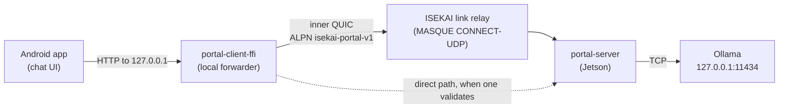
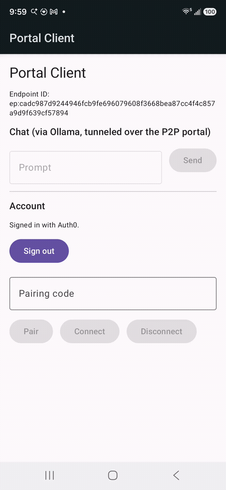

# Tunneling LLM Chat Over MASQUE: the ISEKAI Portal Client

## Main Topic

[ISEKAI link](https://github.com/seera-networks/ISEKAI-link) is Seera Networks' service for connecting devices on different networks over QUIC: it handles authentication and connection brokering, and relays traffic for peers that can't reach each other directly. The relay speaks MASQUE, the IETF's family of HTTP/3-based proxying protocols (here CONNECT-UDP, RFC 9298), so a peer's own QUIC connection travels tunneled inside the relay's. Its first application was a live-video camera pair, covered in the [previous article](https://zenn.dev/seera/articles/3ff5f4507c6f69).

The ISEKAI Portal client is the second, and it carries request/response traffic instead of a one-way video stream: a small Android chat app that forwards HTTP requests to a locally running [Ollama](https://ollama.com) instance on a remote box, over the same relay stack. It's built on `portal-core` and `isekai-p2p` — the same forwarding protocol and session/relay machinery the camera apps use — proving out the general-purpose half of ISEKAI link: instead of a hardcoded video path, an operator declares a named service in a catalogue, and any paired peer can reach it as if it were local.



Every session starts on the relay and moves to a direct path when one validates. In the demo below, the phone starts on the same Wi-Fi network as the Jetson; after it switches to 5G, the reconnected session stays on the relay.


*An Android phone pairs with the Jetson and asks two questions over Wi-Fi, then switches to 5G mid-session; the app reconnects through the relay, and a follow-up question is answered from the chat history.*

## Reusing the Relay, Changing the Stream Shape

`portal-core`'s forwarding model is deliberately generic: one bidirectional QUIC stream per TCP connection, and datagrams keyed by session id for UDP. That's a different shape from `camera-client`'s one-unidirectional-stream-per-frame design — there's no "drop the stale frame" logic here, because a chat request isn't live media, it's a regular request/response HTTP exchange that just happens to be tunneled. The relay, certificates and pairing underneath (`isekai-p2p`) serve both without change — portal even reuses the camera's P2P protocol string. What portal adds sits on top: its own inner ALPN (`isekai-portal-v1`, so a peer that speaks neither video nor portal fails at the handshake rather than mid-stream), the forwarding protocol in `portal-core`, and the service catalogue.

## The Catalogue Is the Whole Policy

This build runs on an NVIDIA [Jetson Orin Nano](https://www.nvidia.com/en-us/autonomous-machines/embedded-systems/jetson-orin/nano-super-developer-kit/), an edge board small enough to sit on a desk with enough GPU to run a local LLM. Nothing in the design depends on it, though: any on-premise machine that can run the model works just as well, such as a Mac mini or an AMD Ryzen AI Halo. The Jetson runs `portal-server`, started with a service catalogue that declares exactly one entry:

```toml
[service.ollama]
protocol = "tcp"
target = "127.0.0.1:11434"
```

The client asks for a service **by name** ("ollama") — never an address — so a paired peer can reach only what the catalogue explicitly offers, and the initiator can never name an arbitrary target. This catalogue is deliberately kept out of `portal-server`'s default config path/name specifically because Ollama has no auth of its own — a catalogue picked up silently by an operator who forgot `--config` would hand a raw local LLM endpoint to any paired peer.

The catalogue draws the line at ports, not at requests. Forwarding is plain layer 4: `portal-server` copies bytes between the tunnel and `127.0.0.1:11434` without reading them, so a paired peer gets the whole Ollama API — not just `/api/chat`, but `/api/pull`, `/api/delete` and `/api/create` too. Limiting individual endpoints would take an HTTP-aware proxy in front of Ollama, which is outside this layer's job. What the design does control is who gets in and where the port lives: only a peer that redeemed a pairing code the operator minted (valid for at most five minutes, and revocable afterwards with `portal-server --revoke`) can open the tunnel, and Ollama stays bound to `127.0.0.1`, so it is never exposed on the LAN.

## Streaming as a Liveness Signal

The first working version used Ollama's `stream: false` and waited for the whole reply. It didn't just look broken — a minute or more of silence over the tunnel made non-streamed replies fail outright. Switching to `stream: true` (Ollama's newline-delimited-JSON streaming format) fixed it without changing total latency; what changed is the time to first token. Real bytes now cross the tunnel continuously while the model generates, the same principle behind the [camera product's](https://zenn.dev/seera/articles/3ff5f4507c6f69) decision to keep relay keepalives flowing rather than let a path go quiet. The app still allows 90 seconds per read, enough to cover a cold model load, which alone took about 40 seconds on the Jetson.

## Model Choice Is Just a Config String

The model running this time is `qwen3.5:4b` — chosen because it fits comfortably in this Jetson Orin Nano's unified memory (shared by its CPU and GPU) alongside everything else sharing the box, not because anything upstream of Ollama cares which model it is. Neither `portal-core`'s forwarding nor the client's HTTP layer look at the model name beyond passing it through in the `/api/chat` request body. Any open-weights model works as a drop-in replacement, as long as it fits the on-premise GPU/NPU hardware it's meant to run on — the tradeoff is entirely local (memory budget, cold-load time, tokens/sec), not architectural.

## Multi-Turn Memory Is Resent, Not Stored

Ollama keeps no state between requests on either `/api/generate` or `/api/chat` — a client has to resend everything it wants remembered. The first version of this app didn't: every request went to `/api/generate` with only the current turn's text, so each reply was effectively the first message the model had ever seen.

The fix switched the client to `/api/chat` and resends the whole conversation on every turn, with the new question last:

```json
{"model": "qwen3.5:4b", "stream": true, "messages": [
  {"role": "user", "content": "whats your model"},
  {"role": "assistant", "content": "I am Qwen3.5."},
  {"role": "user", "content": "what was the question I asked previously?"}
]}
```

Each streamed line's text then arrives under `message.content` instead of `/api/generate`'s flat `response` field.

I verified it with the simplest test that proves memory rather than plausible continuation: I told the model "My favorite color is teal." in one message, asked "What is my favorite color?" in a separate one, and got back "Teal."

The tradeoff this leaves open: the app does no truncation of its own, so the full conversation is resent on every turn. How much of it the model actually sees is bounded on the Ollama side by its context-window setting (`num_ctx`); past that, Ollama silently drops the oldest turns, and a long enough chat will eventually fail the teal test. Raising `num_ctx` pushes that point out, but the value should be sized to the local hardware — a bigger context window means a bigger KV cache, competing for the same memory as the model itself. Fine for a demo's scope; a real deployment would want its own truncation or summarization strategy.

## Auth, Inherited Wholesale

The endpoint-key/Auth0 device-flow pairing model is identical to `camera-client`'s: a fresh ECDSA key generated on first launch and kept in the app's private storage, an Auth0 sign-in, and a pairing Grant tied to the Endpoint ID rather than the session — meaning it survives `portal-server` restarts on the Jetson without needing to be re-paired.

## Design Philosophy

The interesting result isn't the chat UI — it's that swapping "stream video frames" for "tunnel a stateless HTTP API" left the relay, the pairing model and the certificates untouched. Everything new sat on top of them: an inner ALPN, `portal-core`'s forwarding protocol, and a one-entry catalogue. On the client, the only transport-adjacent decisions were streaming the reply and a per-read timeout long enough to survive a cold model load. That's the bet the generic service-catalogue design was making, and it held.
